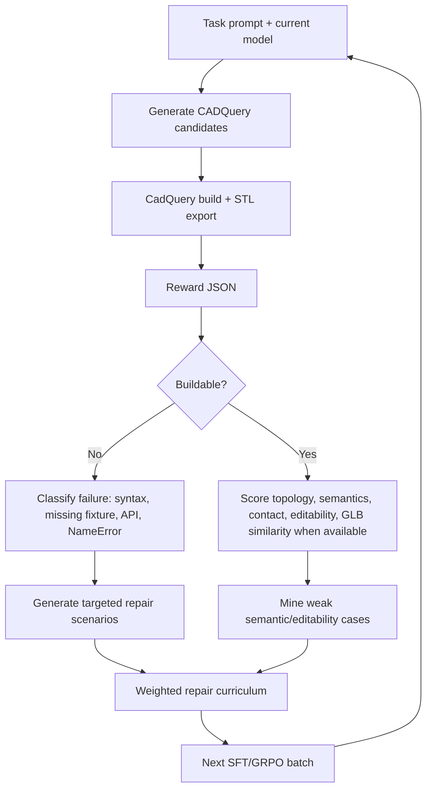
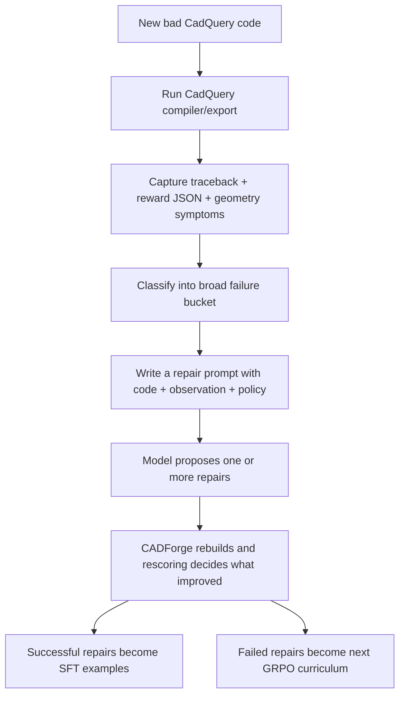

# 21. CADForge Self-Improving RLVE Loops

CADForge should not be a static benchmark. The strongest version is a pair of feedback loops:

1. **Repair curriculum loop**: the model fails inside the CadQuery environment, the environment classifies the failure, then generates the next repair scenarios automatically.
2. **Reference generation loop**: new object prompts create images and GLBs, those GLBs become reference metrics, and the agent is rewarded for producing editable CadQuery that matches the reference.

Together, these loops prove Theme 4 self-improvement: the environment adapts to the model's weaknesses instead of waiting for a human to hand-label every failure.

## Loop A: Adaptive Repair Curriculum

The current strict GRPO run writes completion traces with:

- task id
- generated code
- build status
- CADForge reward JSON
- stdout/stderr tail
- error class
- score

`training/generate_repair_curriculum.py` turns those traces into new repair prompts. It does not need a human to say "this failed because of syntax" or "this missed the fixture." It automatically detects the dominant failure types:

- syntax closure / clipped final union
- missing `fixture`
- invented CadQuery API
- undefined name
- TypeError / ValueError / fragile CAD operation
- disconnected or semantically weak assembly
- low editability

Then it reweights the next curriculum toward the failure modes and tasks with the worst build rate.



## How A Repair Prompt Is Created

The next SFT/GRPO prompt is not just the same object request repeated again. It is the same task plus a different failed state.

A normal prompt-to-CAD row looks like this:

```text
User:
Build a 12-slot axial motor stator.

Assistant:
<complete good CadQuery code>
```

A repair row looks like this:

```text
User:
Task:
Build a 12-slot axial motor stator.

Previous candidate failed CADForge verification.

Observation:
{
  "failure_type": "invented_api",
  "previous_reward": {
    "total": -1.0,
    "build": 0.0
  },
  "error_tail": "AttributeError: Workplane object has no attribute annulus"
}

Adaptive repair policy:
- replace unsupported CadQuery helpers with conservative primitives
- use circle/extrude, cut, union, translate, rotate
- assign the final exportable object to fixture

Previous CadQuery code:
<the model's failed code>

Repair it into a complete executable CadQuery Python file.
Return only the repaired Python file.
```

So the object may be the same, but the question is different because the state is different:

- different failed code
- different reward JSON
- different traceback
- different failure class
- different repair policy
- different task weighting based on what the model is currently bad at

## What If The Error Is New?

The model will absolutely produce errors that are not identical to the examples in the dataset. CADForge handles this by learning broad repair classes, not exact error strings.



The buckets are intentionally general:

| New unseen issue | Failure bucket | Repair instruction |
|---|---|---|
| `AttributeError: Workplane has no method twistExtrude` | invented API | replace with conservative primitives |
| `BRep_API: command not done` | fragile CAD operation | simplify boolean/loft/sweep into boxes/cylinders/cuts |
| code stops mid-union | syntax closure | write a shorter complete file and close all expressions |
| no object exported | missing fixture | assign final model to `fixture` |
| builds but no requested parts | weak semantics | add recognizable named subassemblies |
| parts are floating | disconnected geometry | add bridges, overlaps, ribs, bosses, or root blocks |
| no clear match | unknown build failure | rewrite as a simpler buildable model while preserving task intent |

This means SFT does not need to cover every possible CadQuery error. SFT teaches the model the repair format and common patterns. GRPO teaches it which repairs actually work because the environment executes and scores every candidate.

In short:

```text
SFT teaches: "When you see failure feedback, answer with a repaired complete CAD file."
GRPO teaches: "Among many possible repairs, prefer the one that actually builds and scores higher."
```

## Why This Is Self-Improvement

The environment changes the distribution of future work based on observed failures:

- If the model clips code before `fixture`, the next prompts demand short, closed, valid files.
- If it invents APIs, the next prompts require conservative primitives.
- If it builds but misses semantic parts, the next prompts ask it to repair the same object with named subassemblies.
- If one task family has low build rate, it is sampled more often.

This is different from a fixed benchmark. The environment is a teacher: it observes failure, writes the next lesson, then checks whether the model improved.

## Speed Reality: vLLM vs CadQuery

For GRPO there are two expensive parts:

| Stage | Runs On | Bottleneck |
|---|---|---|
| Qwen rollout generation | GPU | can be accelerated with vLLM server |
| CadQuery build/reward | CPU + CAD kernel | usually the bigger bottleneck once generation is fast |

The current 9B adaptive run uses the GPU for Qwen generation/training. It is not CPU-only model rollout. The slow part is that every candidate is real Python + CadQuery + STL + reward scoring.

vLLM server mode is still the right next optimization, but our current GRPO script cannot combine `--adapter` with `--use-vllm-server` directly. There are two clean paths:

1. **Merge adapter first**: merge the SFT/GRPO LoRA into a standalone checkpoint, serve that checkpoint with vLLM, then run GRPO in server mode.
2. **Serve LoRA adapter through vLLM**: add LoRA-serving support and pass adapter metadata into the GRPO script.

For the hackathon timebox, the safer optimization is:

- keep strict/adaptive GRPO running directly from adapters
- use `reward_mode=fast`
- cache GLB/reference metrics
- keep max completion length lower
- classify failures from debug JSONL instead of rerunning expensive analysis
- run short adaptive rounds rather than one huge run

## Loop B: GLB Reference Generation and Similarity

CADForge should also grow new tasks automatically:

1. Generate a clean white-background product image from a prompt.
2. Use FAL SAM 3D with the image and prompt to produce a GLB.
3. Normalize the GLB scale, orientation, and origin.
4. Extract reference metrics:
   - bounding box
   - silhouette renders
   - point cloud samples
   - voxel occupancy
   - major-part hints
5. Ask a teacher model for CadQuery attempts and repair traces.
6. Score candidates against both the task semantics and the GLB reference.
7. Add successful traces to SFT and failure traces to GRPO repair curricula.

```mermaid
flowchart LR
  P["Object prompt"] --> IMG["GPT image: white-background reference"]
  IMG --> GLB["FAL SAM 3D: image + prompt to GLB"]
  GLB --> REF["Normalize + extract reference metrics"]
  REF --> TASK["CADForge task spec"]
  TASK --> TEACHER["GPT-5.4/5.5 teacher repair traces"]
  TASK --> QWEN["Qwen candidate rollouts"]
  TEACHER --> DATA["SFT dataset"]
  QWEN --> SCORE["Build + topology + semantic + GLB similarity reward"]
  SCORE --> FAIL["Failure mining"]
  FAIL --> CURR["Adaptive GRPO curriculum"]
  DATA --> TRAIN["SFT / GRPO"]
  CURR --> TRAIN
  TRAIN --> QWEN
```



## Did The Latest GRPO Use GLB Similarity?

Partially, by design.

The reward stack still supports reference-backed scoring when `reference_root` exists. However, the latest adaptive GRPO is a fast build-gated repair run. Its main target is to teach:

1. buildable Python
2. final `fixture`
3. conservative CadQuery primitives
4. repair from compiler feedback

The expensive GLB/reference loop should be used more heavily in benchmark reports and teacher data generation. For GRPO, we should use cached reference metrics and only turn on full similarity after the model is reliably buildable. Otherwise the signal is wasted because broken code cannot be compared to a GLB.

## What To Show Judges

Show three levels of evidence:

1. **Space demo**: weak seed gets a lower reward; repaired CAD builds and renders.
2. **Training curves**: 2B SFT, 2B dense GRPO, 9B SFT, 9B strict/adaptive GRPO.
3. **Self-improvement loop**: strict GRPO failures are automatically converted into repair prompts and the next GRPO round.

The strongest sentence:

> CADForge does not just grade CAD. It learns what the model is bad at, generates the next CAD repair scenarios, and trains the model against real compiler/geometry feedback.

## Next Implementation Targets

- Add vLLM server mode after merging LoRA adapters into standalone checkpoints.
- Add a persistent cache for task reference metrics so GLB similarity never preprocesses during GRPO.
- Run adaptive GRPO in 15-30 step rounds and regenerate curriculum after each round.
- Add an automated GLB task generator using GPT Image + FAL SAM 3D + reference metric extraction.
- Track per-failure mastery: build rate and reward trend for each failure class.
