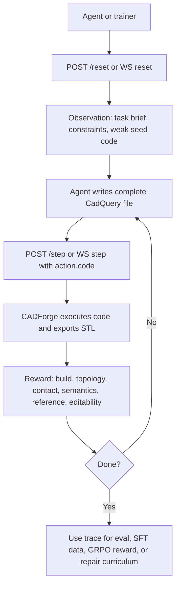
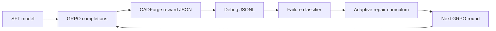

# 22. OpenENV CADForge Training and API Tutorial

This document is the beginner-friendly map for how CADForge uses OpenENV, how an AI agent talks to the environment, and how the same environment reward powers the SFT/GRPO training scripts.

CADForge is an OpenENV environment named `cadforge_cadquery`. It turns code-CAD generation into a repeatable reinforcement-learning environment:

1. The agent receives a mechanical design task.
2. The agent writes a complete CadQuery Python file.
3. OpenENV passes that file into the CADForge environment.
4. CADForge executes the code in a constrained runner, exports an STL, analyzes the mesh, compares it with task/reference signals, and returns a structured observation with reward.
5. Training scripts use that reward to teach Qwen models to produce buildable, editable CAD.

The OpenENV manifest is small because the real behavior lives in the Python environment class:

```yaml
spec_version: 1
name: cadforge_cadquery
type: space
runtime: fastapi
app: server.app:app
port: 8000
```

## Why OpenENV Is Useful Here

Normal supervised data can teach a model what good CadQuery looks like, but it cannot prove that generated code actually builds. OpenENV gives the model an executable world:

- It defines a typed action and typed observation contract.
- It exposes standard `reset`, `step`, `state`, `schema`, `metadata`, and health endpoints.
- It can be deployed as a Hugging Face Space, so external agents and training notebooks can call the same environment over HTTP.
- It returns dense reward, not just pass/fail.
- It logs artifacts for every candidate: code, STL, reward JSON, verifier report, and optional renders.

That matters for CAD because many wrong answers look plausible in text. CADForge catches the expensive failure modes: syntax errors, missing final `fixture`, invented CadQuery APIs, disconnected components, weak task semantics, poor editability, and reference-shape mismatch.

## Project Files That Matter

| File | Role |
|---|---|
| `experiment-2-cadforge/openenv.yaml` | OpenENV deployment manifest. |
| `experiment-2-cadforge/server/app.py` | FastAPI app created by OpenENV, plus Space demo routes. |
| `experiment-2-cadforge/server/cadforge_environment.py` | The `Environment` implementation with `reset`, `step`, `state`, and metadata. |
| `experiment-2-cadforge/server/openenv_models.py` | Pydantic action, observation, and state models. |
| `experiment-2-cadforge/python_tools/cadquery_env.py` | The reward kernel: execute CadQuery, export STL, score geometry, write artifacts. |
| `experiment-2-cadforge/client.py` | Tiny HTTP client for `/reset` and `/step`. |
| `training/train_sft_unsloth.py` | LoRA SFT training on prompt-to-CAD and repair traces. |
| `training/train_grpo_cadforge.py` | GRPO training with cheap or real CADForge reward. |
| `training/generate_repair_curriculum.py` | Mines failed GRPO completions into new repair prompts. |
| `training/run_self_improving_cadforge_loop.sh` | Repeats failure mining, GRPO, and reporting. |

## The Agent Loop

At the environment level, CADForge follows the OpenENV pattern:



The key idea is simple: the model does not call random tools. It submits one complete Python CadQuery file as the action. The environment owns execution and verification.

## Action Schema

The action model is `CadForgeAction`:

```json
{
  "metadata": {},
  "code": "complete executable Python CadQuery file",
  "task_id": "four_leg_chair_700n",
  "reward_mode": "fast",
  "task_prompt": "optional prompt override"
}
```

Fields:

- `code`: required. The complete candidate CadQuery file.
- `task_id`: selects a task from `experiment-2-cadforge/data/cad_tasks.json`.
- `reward_mode`: `fast` for training, `full` for heavier reports with masks/renders.
- `task_prompt`: optional natural-language override if a trainer wants to score against a custom task prompt.
- `metadata`: optional OpenENV metadata inherited from the base action model.

The environment constraints tell the agent to:

- return a complete Python file, not markdown;
- use `import cadquery as cq`;
- assign the final exportable object to `fixture`, `result`, `model`, `solid`, `body`, `part`, or `show_object(obj)`;
- avoid file IO, networking, subprocesses, `eval`, `exec`, unsupported imports, and CQ-editor-only helpers;
- prefer named dimensions, helper functions, connected parts, and robust CadQuery operations.

In practice, training prompts are stricter and prefer final assignment to `fixture`.

## Observation Schema

The observation model is `CadForgeObservation`:

```json
{
  "task_brief": "natural language design brief",
  "task_id": "caster_wheel_fork",
  "constraints": ["runtime and CadQuery rules"],
  "current_code": "seed or latest submitted code",
  "reward_json": {
    "total": 0.82,
    "build": 1.0,
    "topology": 0.74,
    "contact": 0.91,
    "semantic_parts": 0.86,
    "reference_similarity": 0.63,
    "silhouette": 0.50,
    "editability": 0.77,
    "efficiency": 1.0
  },
  "verifier_notes": ["human-readable feedback"],
  "artifacts_dir": "runs/cadquery-env/<episode>/<step>",
  "renders": {},
  "trace": [],
  "done": false,
  "reward": 0.82
}
```

The environment marks an episode done when reward reaches `0.92` or when the session reaches `12` steps. Plain HTTP `/step` is useful for one-shot scoring because each request creates a fresh environment instance. For a true multi-step episode with preserved state and trace, use the WebSocket `/ws` session.

## Reward Modes

`fast` mode is the training default. It avoids expensive color renders and uses a dense scalar:

```text
0.22 build
+ 0.17 topology
+ 0.12 contact
+ 0.25 semantic parts
+ 0.10 reference similarity
+ 0.10 editability
+ 0.04 efficiency
```

`full` mode is for evaluation and reporting. It adds masks/renders and gives more weight to visual silhouette/reference comparison:

```text
0.18 build
+ 0.17 topology
+ 0.10 contact
+ 0.15 semantic parts
+ 0.15 reference similarity
+ 0.10 silhouette
+ 0.10 editability
+ 0.05 efficiency
```

If CadQuery execution fails, the reward is negative:

```json
{
  "total": -1.0,
  "build": 0.0,
  "topology": 0.0,
  "semantic_parts": 0.0,
  "reference_similarity": 0.0,
  "silhouette": 0.0,
  "editability": 0.0,
  "efficiency": 0.0
}
```

This is why OpenENV is central to training: it separates valid CAD from text that merely looks like CAD.

## OpenENV API Surface

The OpenENV FastAPI app exposes the standard environment API:

| Endpoint | Method | Purpose |
|---|---:|---|
| `/docs` | GET | Swagger UI for the live API. |
| `/redoc` | GET | ReDoc API documentation. |
| `/openapi.json` | GET | OpenAPI schema. |
| `/health` | GET | Standard OpenENV health check. |
| `/metadata` | GET | Environment name, description, version, author. |
| `/schema` | GET | JSON schemas for action, observation, and state. |
| `/state` | GET | Current state for a fresh simulation instance. |
| `/reset` | POST | Start an episode and return initial observation. |
| `/step` | POST | Execute one action and return observation, reward, done. |
| `/ws` | WebSocket | Persistent stateful reset/step/state/close session. |
| `/mcp` | POST or WebSocket | Generic OpenENV MCP route. CADForge does not currently add custom MCP tools, so normal agents should use `/step` or `/ws`. |

CADForge also adds Space/demo routes:

| Endpoint | Method | Purpose |
|---|---:|---|
| `/` and `/web` | GET | Human-facing Space page. |
| `/healthz` | GET | CADForge-specific health check. |
| `/api/space/demo` | POST | Score a built-in demo candidate for a task. |
| `/api/space/repair-loop` | POST | Score a weak seed and repaired candidate for comparison. |
| `/api/space/stl/{task_id}` | GET | Download the latest demo STL. |
| `/api/space/loop-stl/{task_id}` | GET | Download the repaired loop STL. |
| `/api/space/loop-stl/{task_id}/{step_id}` | GET | Download a specific loop STL, usually `broken` or `repaired`. |

The live Space URL is:

```text
https://sanjuhs-cadforge-cadquery-openenv.hf.space
```

The Hugging Face repository page is:

```text
https://huggingface.co/spaces/sanjuhs/cadforge-cadquery-openenv
```

## Minimal HTTP Tutorial

Start locally:

```bash
cd experiment-2-cadforge
uv sync
openenv validate .
PYTHONPATH=python_tools uv run uvicorn server.app:app --host 0.0.0.0 --port 8000
```

Reset an episode:

```bash
curl -s http://localhost:8000/reset \
  -H "Content-Type: application/json" \
  -d '{
    "episode_id": "tutorial-001",
    "task_id": "caster_wheel_fork"
  }'
```

Score one candidate:

```bash
curl -s http://localhost:8000/step \
  -H "Content-Type: application/json" \
  -d '{
    "action": {
      "task_id": "caster_wheel_fork",
      "reward_mode": "fast",
      "code": "import cadquery as cq\nplate = cq.Workplane(\"XY\").box(44, 44, 4).translate((0, 0, 2))\nfixture = plate.clean()"
    }
  }'
```

The response has this wrapper shape:

```json
{
  "observation": {
    "task_id": "caster_wheel_fork",
    "reward_json": {},
    "verifier_notes": [],
    "artifacts_dir": "...",
    "done": false,
    "reward": 0.0
  },
  "reward": 0.0,
  "done": false
}
```

To run against the live Hugging Face Space, change the base URL:

```bash
OPENENV_BASE_URL=https://sanjuhs-cadforge-cadquery-openenv.hf.space
```

For quick smoke checks:

```bash
curl -s https://sanjuhs-cadforge-cadquery-openenv.hf.space/healthz
curl -s https://sanjuhs-cadforge-cadquery-openenv.hf.space/schema
```

## Python Client Example

`experiment-2-cadforge/client.py` wraps `/reset` and `/step`:

```python
import os
from client import CadForgeClient

os.environ["OPENENV_BASE_URL"] = "https://sanjuhs-cadforge-cadquery-openenv.hf.space"

client = CadForgeClient()
initial = client.reset(task_id="caster_wheel_fork", episode_id="remote-tutorial")

code = """
import cadquery as cq

plate = cq.Workplane("XY").box(44, 44, 4).translate((0, 0, 2))
stem = cq.Workplane("XY").cylinder(16, 5).translate((0, 0, 10))
fixture = plate.union(stem).clean()
""".strip()

result = client.step({
    "task_id": "caster_wheel_fork",
    "reward_mode": "fast",
    "code": code,
})

print(result["observation"]["reward_json"])
print(result["observation"]["verifier_notes"])
```

Run it from `experiment-2-cadforge` so `from client import CadForgeClient` resolves.

## How Training Uses OpenENV

There are two training stages.

### 1. SFT: Teach The Format

`training/train_sft_unsloth.py` trains a LoRA adapter on JSONL chat rows. Those rows include:

- cold-start prompt-to-CadQuery examples;
- repair examples where a previous candidate failed;
- verifier observations and target repaired code.

Before training:

```bash
uv run training/prepare_sft_mix.py --cold-start-upsample 4
uv run training/smoke_cadforge_reward.py --reward-mode fast
```

The first command creates the mixed SFT train/validation files. The second command proves the same CADForge reward backend can execute and score a known candidate.

SFT teaches the model:

- return only executable Python;
- use CadQuery correctly;
- assign the final object to `fixture`;
- repair from environment feedback;
- write named, editable dimensions and helper functions.

### 2. GRPO: Learn From Executed Reward

`training/train_grpo_cadforge.py` performs policy optimization. It samples completions, extracts CadQuery code, scores each completion, and gives scalar reward to TRL GRPO.

For a wiring smoke test:

```bash
uv run training/train_grpo_cadforge.py \
  --model unsloth/Qwen3.5-2B \
  --output-dir outputs/qwen35-2b-cadforge-grpo-smoke \
  --reward-backend cheap \
  --limit-prompts 8 \
  --max-steps 5 \
  --num-generations 4
```

For real CADForge reward:

```bash
uv run training/train_grpo_cadforge.py \
  --model unsloth/Qwen3.5-2B \
  --output-dir outputs/qwen35-2b-cadforge-grpo-cadforge-smoke \
  --reward-backend cadforge \
  --cadforge-reward-mode fast \
  --limit-prompts 4 \
  --max-steps 2 \
  --num-generations 4
```

The production GRPO script calls `python_tools/cadquery_env.py evaluate` by subprocess instead of sending every completion over HTTP. That is deliberate:

- local subprocess scoring is faster on RunPod;
- it avoids Space network latency and public Space rate limits;
- it uses the same evaluator that the OpenENV `/step` route uses;
- it keeps reward artifacts in local training directories.

So the relationship is:

```text
OpenENV /step -> CadForgeCadQueryEnvironment.step -> evaluate_code(...)
GRPO reward -> CadforgeReward.__call__ -> cadquery_env.py evaluate -> evaluate_code(...)
```

Both paths converge on the same reward kernel.

## Using The Hugging Face Space From Training Scripts

Use the live Space directly when you want a portable smoke test, an external agent integration, a demo notebook, or a small amount of remote scoring.

For large GRPO runs, prefer local reward execution on the training machine. A GRPO step may score many completions, and each completion runs CadQuery plus mesh analysis. Sending all of that through the public Space will be slower and less reliable than running the evaluator beside the trainer.

A minimal remote reward function looks like this:

```python
import json
import urllib.request

SPACE_URL = "https://sanjuhs-cadforge-cadquery-openenv.hf.space"

def score_with_space(code: str, task_id: str, reward_mode: str = "fast") -> float:
    payload = {
        "action": {
            "code": code,
            "task_id": task_id,
            "reward_mode": reward_mode,
        }
    }
    request = urllib.request.Request(
        f"{SPACE_URL}/step",
        data=json.dumps(payload).encode("utf-8"),
        headers={"Content-Type": "application/json"},
        method="POST",
    )
    with urllib.request.urlopen(request, timeout=240) as response:
        result = json.loads(response.read().decode("utf-8"))
    observation = result["observation"]
    return float(observation.get("reward", result.get("reward", 0.0)) or 0.0)
```

Drop this into a small trainer or notebook when you want to prove that a candidate can be evaluated through the deployed OpenENV API.

## Self-Improving Loop

The self-improving path is:



`training/generate_repair_curriculum.py` reads GRPO debug completions and classifies failures:

- `syntax_closure`
- `missing_fixture`
- `invented_api`
- `undefined_name`
- `type_or_value`
- `disconnected_or_weak`
- `low_editability`
- `unknown_build_failure`

It then creates new repair prompts containing:

- the original task;
- the failed code excerpt;
- the previous reward JSON;
- the traceback or verifier notes;
- a targeted repair policy;
- a curriculum weight based on build rate and failure frequency.

That is the project-level self-improvement story: OpenENV provides the world, CADForge provides the grader, and the training loop turns failures into the next lesson.

## Deployment And Push

Validate the Space package:

```bash
cd experiment-2-cadforge
openenv validate .
```

Run locally:

```bash
PYTHONPATH=python_tools uv run uvicorn server.app:app --host 0.0.0.0 --port 8000
```

Push to Hugging Face Spaces:

```bash
set -a
source ../.env
set +a
openenv push . --repo-id sanjuhs/cadforge-cadquery-openenv --interface
```

After pushing, smoke test:

```bash
curl -s https://sanjuhs-cadforge-cadquery-openenv.hf.space/healthz
curl -s https://sanjuhs-cadforge-cadquery-openenv.hf.space/metadata
curl -s https://sanjuhs-cadforge-cadquery-openenv.hf.space/schema
```

## Mental Model For New Contributors

If you are new to OpenENV, think of this project as three layers:

1. **OpenENV layer**: standard typed API for agents: action in, observation/reward out.
2. **CADForge layer**: domain-specific simulator and verifier for CadQuery CAD.
3. **Training layer**: SFT teaches the format, GRPO uses the environment reward, adaptive repair turns failures into new prompts.

The shortest useful path is:

```text
clone repo
-> install with uv
-> openenv validate
-> run uvicorn
-> POST /step with CadQuery code
-> inspect reward_json and artifacts_dir
-> use the same reward in SFT/GRPO scripts
-> push the OpenENV Space when ready
```

That is the whole CADForge/OpenENV loop: executable tasks, typed actions, verifiable observations, dense reward, and training scripts that can keep improving from environment feedback.
