# CADForge: Teaching Small Models to Generate Buildable, Editable CAD

> Frontier models can talk about engineering geometry. CADForge asks a harder question: can a model write CAD code that compiles, exports, edits, and improves when a real verifier pushes back?

CADForge is an OpenEnv reinforcement-learning environment for code-CAD. The agent receives a design request, writes a complete CadQuery Python file, runs it through a real CadQuery/STL/reward backend, sees structured feedback, and learns to repair the model over repeated attempts.

## Judge Reproducibility Links

| Artifact | Link |
|---|---|
| GitHub repo | [sanjuhs/open-env-meta-final-hackathon](https://github.com/sanjuhs/open-env-meta-final-hackathon) |
| Google Colab smoke notebook | [cadforge_openenv_training_colab.ipynb](https://colab.research.google.com/github/sanjuhs/open-env-meta-final-hackathon/blob/main/training/cadforge_openenv_training_colab.ipynb) |
| HF Space | [sanjuhs/cadforge-cadquery-openenv](https://huggingface.co/spaces/sanjuhs/cadforge-cadquery-openenv) |
| Training script bundle / gist-ready source | [training/GITHUB_GIST_TRAINING_SCRIPTS.md](https://github.com/sanjuhs/open-env-meta-final-hackathon/blob/main/training/GITHUB_GIST_TRAINING_SCRIPTS.md) |
| Raw logs and evidence archive | [sanjuhs/cadforge-training-evidence](https://huggingface.co/datasets/sanjuhs/cadforge-training-evidence) |

The full SFT and GRPO runs were executed on a RunPod H200 through distinct production scripts. The Colab notebook is the public judge-runnable smoke path: it validates OpenEnv, loads the public dataset, runs the CadQuery reward backend, and launches tiny SFT/GRPO checks using the same source files.

The important distinction is this:

| Mesh generation | Code-CAD generation |
|---|---|
| produces a visual asset | produces editable engineering code |
| may look plausible | must compile and export geometry |
| often loses dimensions and design intent | keeps named dimensions, helper functions, and final assemblies |
| hard to repair through code | repairable by editing the feature tree |

CADForge is not trying to replace professional CAD in one shot. It is trying to create the missing training environment that lets models practice the real loop: write CAD, compile, inspect reward, repair, and repeat.

## The Problem: Frontier Models Still Fail at Complex CAD

We tested frontier models on a deceptively simple object: an IKEA Markus-style chair. The prompt is not a pure art prompt. It asks for a coherent code-CAD assembly with a seat, backrest, armrests, gas cylinder, star base, wheels, proportions, and final assembly.

The screenshots below show why CAD needs an environment, not just a better one-shot prompt.

### Claude Opus 4.7

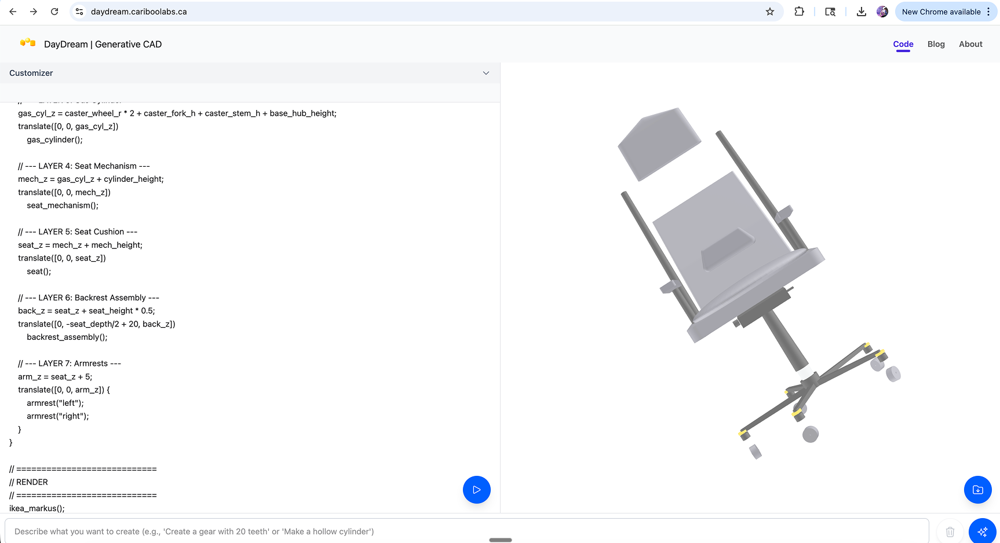

Claude produced structured code and a recognizable intent, but the rendered assembly was not physically coherent. Large components floated, proportions drifted, and the final model did not behave like a connected CAD assembly.

### GPT-5.5

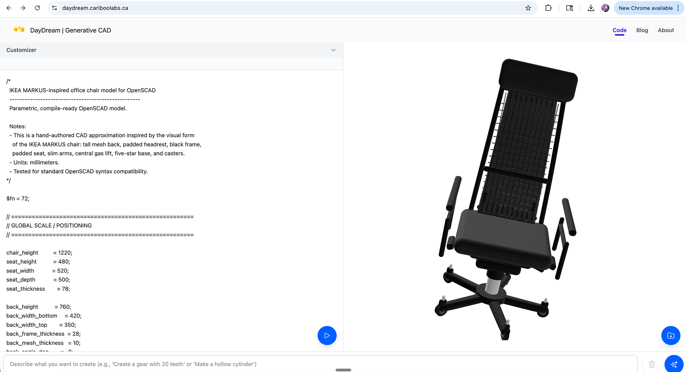

GPT-style frontier models can often produce verbose code, but complex CAD exposes brittle failure modes: clipped assemblies, weak connectivity, missing final fixtures, invented or fragile primitives, and proportions that do not match the reference.

### DeepSeek V4 Pro

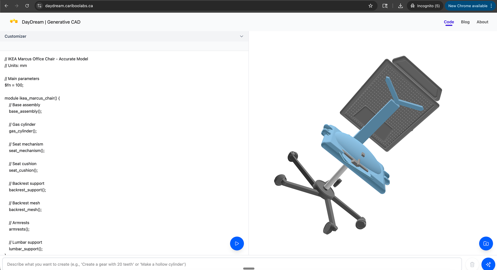

DeepSeek showed the same pattern: plausible object vocabulary but weak executable geometry. This is exactly the gap CADForge targets. The problem is not only intelligence; it is training signal.

### Gemini 3.1 Pro

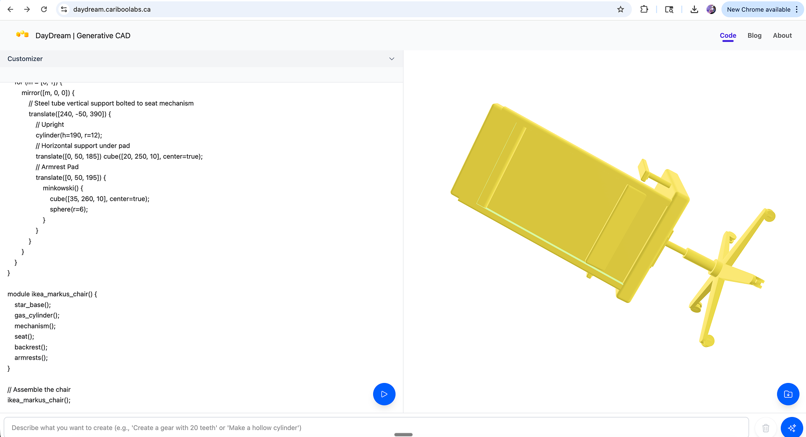

Gemini was comparatively stronger in these experiments. That matters because it hints that the task is learnable. The missing ingredient is not magic. It is repeated interaction with a verifier that rewards buildable, editable CAD.

## Why One-Shot CAD Fails

Complex CAD has several failure modes that plain text rewards do not catch:

| Failure | What it looks like | Why normal LLM training misses it |
|---|---|---|
| Syntax closure | code stops before closing the final union | text may look plausible until executed |
| Invented API | `Workplane.annulus()` or unsupported helpers | the model learns API-shaped language, not exact CAD APIs |
| Missing final fixture | no exportable final object | the answer reads like code but the environment has nothing to export |
| Floating parts | wheels, brackets, or backrests do not touch | language plausibility does not enforce contact geometry |
| Bad topology | non-manifold or brittle boolean output | only a CAD kernel can expose it |
| Weak semantics | generic blocks instead of requested parts | visual similarity and task hints need explicit reward |
| Low editability | opaque mesh-like code with no named dimensions | useful CAD needs parameters and reusable subassemblies |

This is why CADForge uses execution, mesh metrics, and reward JSON. It turns each failure into a training signal.

## The Initial Scope Was Even Bigger

The original ambition included CAD generation plus load analysis: generate a bracket, hook, fixture, or chair; run structural analysis; estimate safety factor; and reward mechanical strength under load.

That is still the long-term direction, but the hackathon scope was too large for a stable end-to-end FEA loop. We narrowed the MVP to the hardest prerequisite:

1. generate executable CadQuery,
2. export usable geometry,
3. score connectedness and semantics,
4. reward editability,
5. repair based on verifier feedback.

That narrowing was important. If the CAD does not compile, load analysis cannot even begin.

## What Makes CADForge Different

CADForge sits between three worlds: CAD program synthesis, image-to-3D reconstruction, and RL environments for tool-using agents.

| Category | What existing work usually optimizes | Limitation | CADForge difference |
|---|---|---|---|
| RLCAD-style CAD gyms | reconstruct CAD command sequences from existing B-Rep geometry | mostly reverse-engineering from target geometry, not open-ended object design | starts from a task prompt or reference object and rewards buildability, semantics, contact, and editability |
| CAD-RL / ExeCAD-style training | executable CADQuery from text or multimodal input | highly relevant, but more dataset/model-training oriented | exposes an interactive OpenEnv loop: generate, compile, validate, reward, repair |
| CSG program synthesis | recover constructive solid geometry programs | often synthetic/simple shapes, less engineering workflow | rewards code-CAD structure, named parameters, final assemblies, and physical connectedness |
| Image-to-3D / SAM 3D pipelines | visual 3D mesh reconstruction | GLBs are usually not editable CAD | uses image-to-GLB as a reference signal, then trains code-CAD to approximate it while staying editable |
| Frontier model direct CAD | one-shot code generation | brittle syntax, geometry, and assembly failures | converts every failure into reward and curriculum data |
| Generic text/image-to-3D | visual plausibility | not parametric, not dimensioned, not mechanically validated | targets real CadQuery code with STL/STEP pathway |

Related work shows the field is moving fast. RLCAD frames CAD generation as an RL gym over command sequences from B-Rep geometry, while CAD-RL/ExeCAD explores RL post-training for CADQuery executability and geometric accuracy. CSGNet showed the older shape-to-program direction for constructive solid geometry. SAM 3D-style systems make image-to-3D reconstruction much easier, but those outputs are still mesh references, not editable CAD. CADForge uses those ideas as ingredients for an OpenEnv training loop.

## The Environment Loop

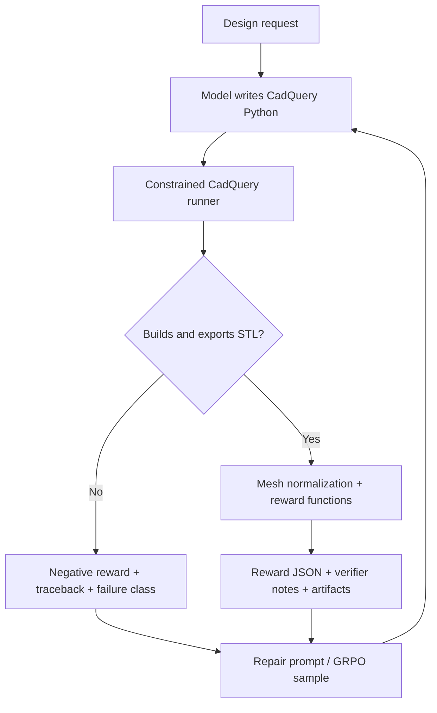
```mermaid
flowchart TD
  A["Design request"] --> B["Model writes CadQuery Python"]
  B --> C["Constrained CadQuery runner"]
  C --> D{"Builds and exports STL?"}
  D -- "No" --> E["Negative reward + traceback + failure class"]
  D -- "Yes" --> F["Mesh normalization + reward functions"]
  F --> G["Reward JSON + verifier notes + artifacts"]
  E --> H["Repair prompt / GRPO sample"]
  G --> H
  H --> B
```

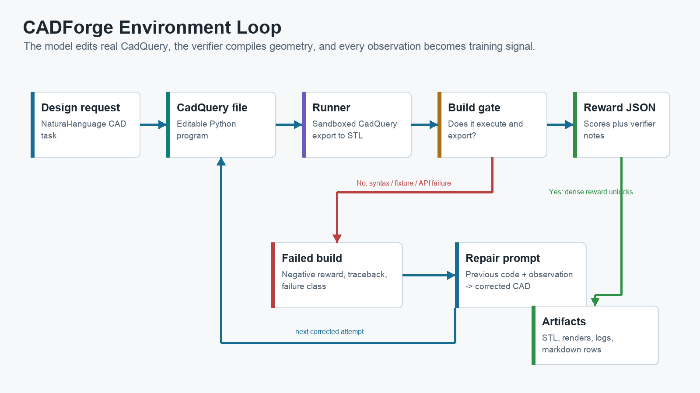

Every episode can write:

- generated CadQuery code,
- build logs and tracebacks,
- STL exports,
- rendered views,
- reward JSON,
- verifier notes,
- markdown reports,
- training rows for SFT or GRPO.

This is why the project fits OpenEnv: the model is not answering a static question. It is interacting with a real toolchain and a persistent stateful environment.

## Reward Design

CADForge rewards are layered because CAD has multiple ways to fail.

| Reward dimension | Full reward weight | Fast GRPO weight | What it checks | Why it matters |
|---|---:|---:|---|---|
| Build | 0.18 | 0.22 | Python + CadQuery executes and exports geometry | broken code is not CAD |
| Topology | 0.17 | 0.17 | non-empty volume, sane bounds, component count, watertight/manifold proxies | prevents empty or broken outputs |
| Contact | 0.10 | 0.12 | disconnected parts and excessive gaps | physical assemblies need contact or intentional joints |
| Semantic parts | 0.15 | 0.25 | task-specific hints in code and geometry | a stator should have ring/teeth/shaft opening; a caster should have wheel/fork/axle |
| Reference similarity | 0.15 | 0.10 | bbox, silhouettes, point/voxel/mesh metrics when a GLB exists | aligns code-CAD to reference objects |
| Silhouette | 0.10 | included in fast reference proxy | rendered outline agreement | useful for reports, too expensive for every GRPO step |
| Editability | 0.10 | 0.10 | named dimensions, helper functions, final `fixture`, clean reusable structure | rewards useful CAD, not opaque mesh blobs |
| Efficiency | 0.05 | 0.04 | compact, stable code | discourages bloated or fragile programs |

The full reward is better for reports and offline evaluation because it can spend more time on reference and silhouette checks. The fast reward is what we use inside GRPO. It keeps the same shape, but replaces expensive visual metrics with cheaper proxies so training can call the verifier many times.

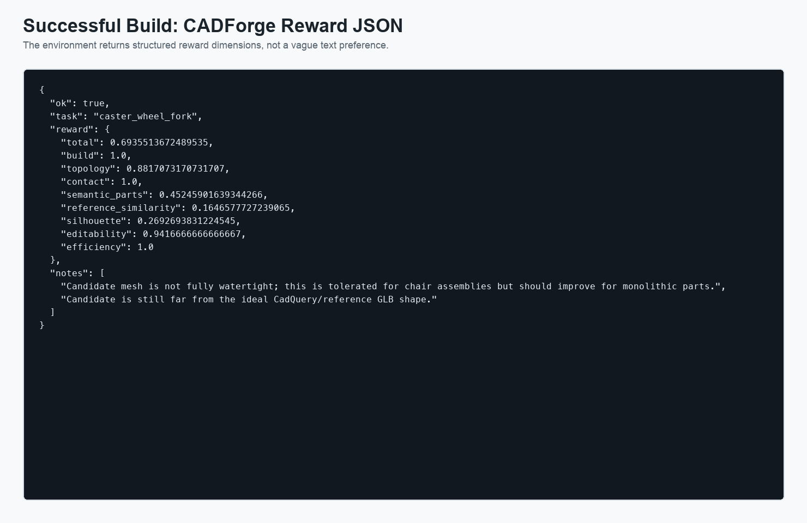

We tried several reward variants before the current one:

| Variant | What it did | What we learned |
|---|---|---|
| Cheap code reward | rewarded imports, `fixture`, `Workplane`, functions, and semantic words | useful only for smoke tests; too easy to game with code-shaped text |
| Dense CADForge reward | gave partial credit for topology, semantics, editability, and reference hints | reward improved, but build rate stayed at 0% because failed builds still got positive-looking signal |
| Build-fail shaping | softened failed builds with a small code-shape reward | this was the biggest mistake: it made broken CAD look trainable while the verifier was still rejecting every export |
| Strict build-gated reward | failed builds are negative; dense reward unlocks only after build succeeds | produced the first real jump: 96/320 strict GRPO completions built |
| Adaptive repair GRPO | starts from strict GRPO and trains directly on categorized failures | designed to reduce syntax closure, missing fixture, invented API, and clipped final assemblies |

The key lesson from training was reward order. Dense reward was useful, but too forgiving. The model could receive partial reward while still failing the build gate. The strict reward changed the order:

1. if CadQuery does not build, return a negative reward with diagnostics;
2. if it builds, unlock the dense CADForge rewards;
3. mine the failure class for the next curriculum.

For failed builds, the current strict gate uses the cheap code score only as a small diagnostic shaper inside a negative range. In plain language: a broken file can be "less bad" if it has the right skeleton, but it cannot receive a good reward until it actually builds.

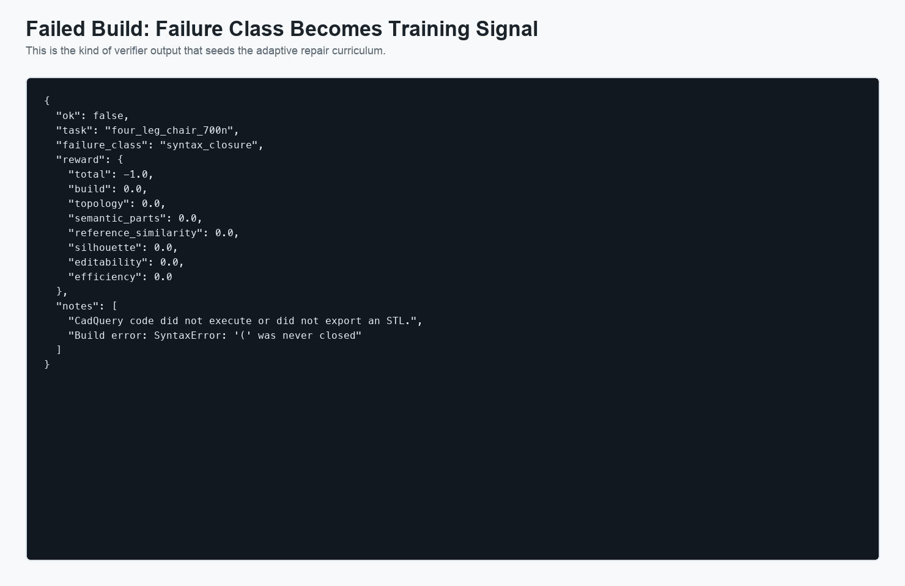

The other fix was logging. Early summaries depended too much on weak signals and truncated stdout. The current debug rows store the generated code, parsed reward JSON, build flag, total CADForge score, error class, and stdout/stderr tails. That made the failure distribution visible enough to become curriculum data.

## Training Data: What the Model Actually Saw

The dataset combined two different skills.

### Cold-Start Prompt to CAD

These rows teach the model how to produce a complete first answer.

```text
User:
Design a small caster wheel assembly as editable code-CAD.
Include a wheel, axle, U-shaped fork, swivel stem, and top mounting plate with four holes.

Assistant:
import cadquery as cq

wheel_r = 16
wheel_w = 8
...
fixture = plate.union(fork).union(wheel).clean()
```

### Repair From Environment Feedback

These rows teach the model how to respond when CADForge finds a concrete failure.

```text
User:
Task:
Build a 12-slot axial motor stator.

Previous candidate failed CADForge verification.

Observation:
{
  "failure_type": "invented_api",
  "previous_reward": {"total": -1.0, "build": 0.0},
  "error_tail": "AttributeError: Workplane object has no attribute annulus"
}

Previous CadQuery code:
<failed code>

Repair it into a complete executable CadQuery Python file.
Return only the repaired Python file.

Assistant:
<corrected complete CadQuery file>
```

The SFT mix intentionally upsamples cold-start rows, meaning those rows are repeated more often. That does **not** mean they are excluded. It means the opposite: because repair traces outnumber first-attempt examples, the training mix repeats prompt-to-CAD rows so the model learns both starting and repairing.

## Two Self-Improvement Loops

CADForge has two loops. One improves the model from its own failures. The other scales task diversity from prompts, images, and GLBs.

### Loop 1: Adaptive Repair Curriculum

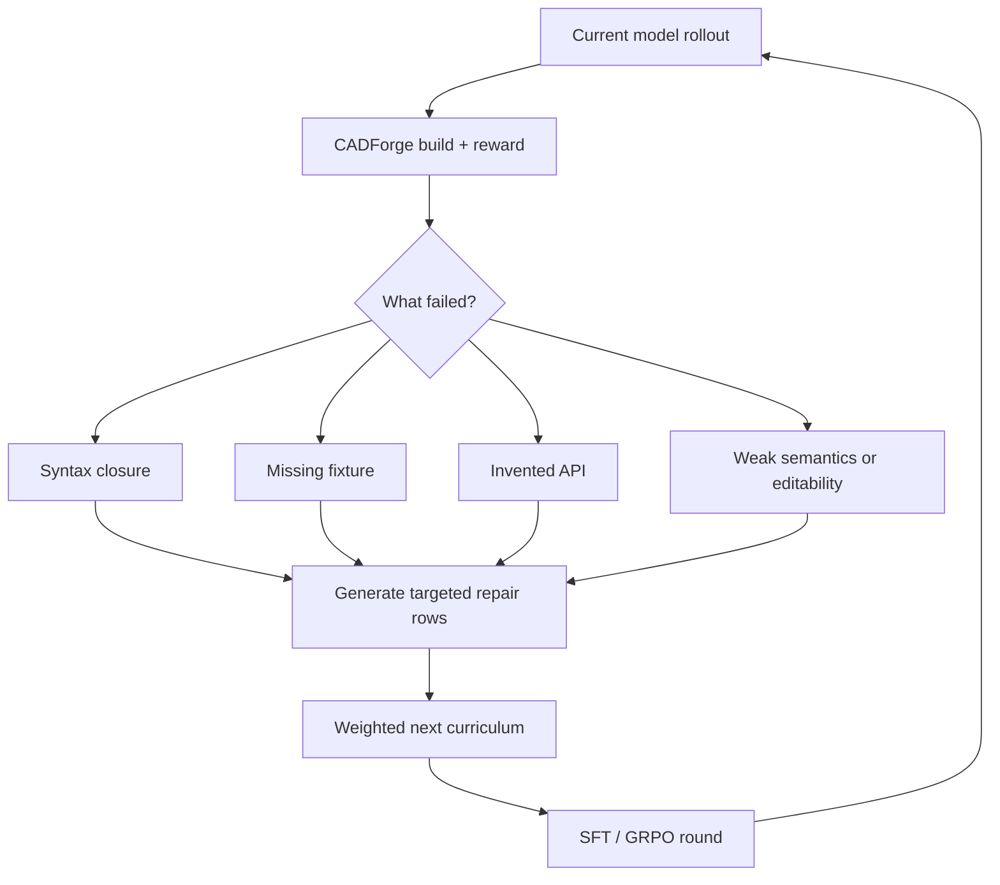
```mermaid
flowchart TD
  A["Current model rollout"] --> B["CADForge build + reward"]
  B --> C{"What failed?"}
  C --> D["Syntax closure"]
  C --> E["Missing fixture"]
  C --> F["Invented API"]
  C --> G["Weak semantics or editability"]
  D --> H["Generate targeted repair rows"]
  E --> H
  F --> H
  G --> H
  H --> I["Weighted next curriculum"]
  I --> J["SFT / GRPO round"]
  J --> A
```

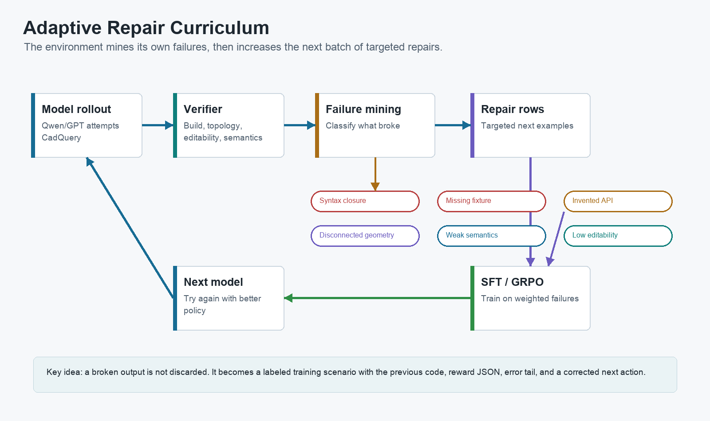

This is the environment "fighting back." If the model keeps clipping code before `fixture`, the next batch includes more syntax-closure repairs. If it invents APIs, the next batch asks it to rewrite using conservative primitives. If it builds but misses semantics, the next batch asks for named subassemblies and recognizable features.

The adaptive curriculum generator produced a 180-row repair set from 320 strict GRPO rollouts. It found:

| Failure class | Count |
|---|---:|
| syntax closure | 110 |
| type/value/CAD kernel errors | 47 |
| disconnected or weak geometry | 26 |
| undefined names | 20 |
| invented API | 17 |
| missing fixture | 15 |
| unknown build failure | 15 |
| low editability | 4 |

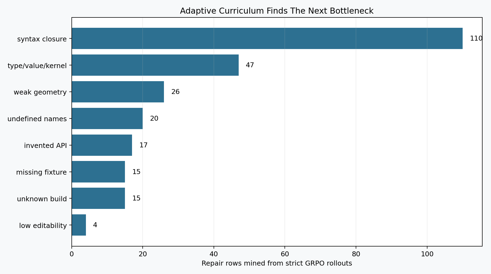

This is the next curriculum target. It should be run as staged curriculum: first short buildable repairs with generous completion length, then harder semantic and reference-similarity repairs after the model is reliably closing files.

This is still valuable. It proves the environment can discover a new weakness automatically and produce the next training distribution.

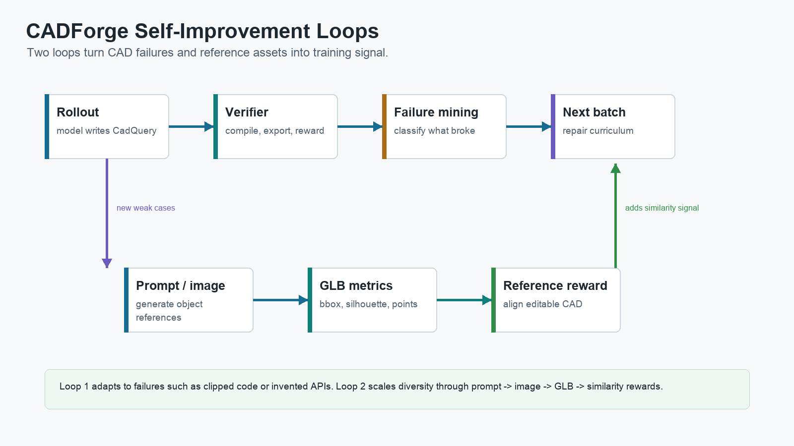

### Loop 2: Prompt to Image to GLB to CAD Reward

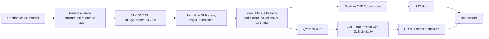
```mermaid
flowchart LR
  A["Random object prompt"] --> B["Generate white-background reference image"]
  B --> C["SAM 3D / FAL image+prompt to GLB"]
  C --> D["Normalize GLB scale, origin, orientation"]
  D --> E["Extract bbox, silhouette, point cloud, voxel, major-part hints"]
  E --> F["Teacher CADQuery traces"]
  E --> G["Qwen rollouts"]
  F --> H["SFT data"]
  G --> I["CADForge reward with GLB similarity"]
  I --> J["GRPO / repair curriculum"]
  H --> K["Next model"]
  J --> K
```

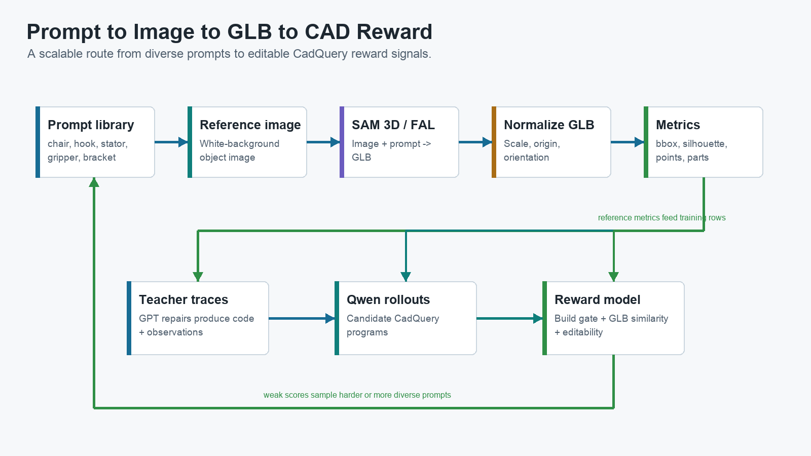

This is the scalable route. A human does not need to hand-design every CAD target. The pipeline can generate many task prompts, create reference images, turn them into GLBs, extract similarity signals, and train models to write editable CadQuery that approximates the object.

The wedge is important:

> Image-to-3D gives us a reference mesh. CADForge turns that reference into a reward signal for editable code-CAD.

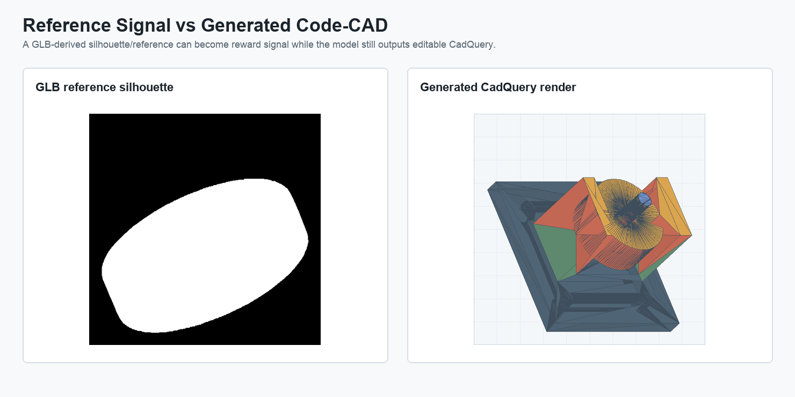

With 3,000 to 5,000 diverse objects, this becomes a plausible route to a small CAD-specialist model that can start from a prompt, generate buildable CadQuery, and repair itself under verifier feedback.

## Training Runs

The model artifacts are on Hugging Face:

| Artifact | What it means | Link |
|---|---|---|
| Qwen3.5-2B SFT | small model learns CADQuery grammar and repair format | [model](https://huggingface.co/sanjuhs/qwen35-2b-cadforge-sft-lora) |
| Qwen3.5-2B SFT + GRPO | first dense reward probe | [model](https://huggingface.co/sanjuhs/qwen35-2b-cadforge-grpo-lora) |
| Qwen3.5-9B SFT | larger model learns syntax/style faster | [model](https://huggingface.co/sanjuhs/qwen35-9b-cadforge-sft-lora) |
| Qwen3.5-9B SFT + dense GRPO | dense reward before strict build gating | [model](https://huggingface.co/sanjuhs/qwen35-9b-cadforge-grpo-lora) |
| Qwen3.5-9B strict GRPO | first buildability breakthrough; build-gated reward | [model](https://huggingface.co/sanjuhs/qwen35-9b-cadforge-grpo-strict-build-lora) |
| Qwen3.5-9B adaptive repair GRPO | final repair-specialist run; fixes clipping and trains on mined failures | [model](https://huggingface.co/sanjuhs/qwen35-9b-cadforge-grpo-adaptive-repair-lora) |

The raw evidence bundle is also public:

- Training logs and reports: [sanjuhs/cadforge-training-evidence](https://huggingface.co/datasets/sanjuhs/cadforge-training-evidence)
- Compressed archive on that dataset: `archives/cadforge-training-evidence-20260426.tar.gz`
- Per-completion reward traces: `training/logs/*completions.jsonl`
- Parsed plots and metrics: `training/reports/*`

Those logs are the backbone of the story. They show when scalar reward looked good but buildability was still zero, when strict build gating created a real separation, and when adaptive repair fixed the clipped-output failure.

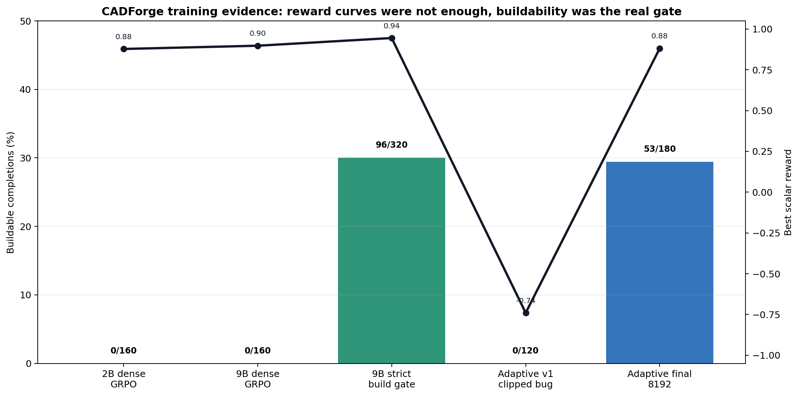

### SFT Results

SFT clearly worked. It taught the base models the language and structure of CadQuery outputs.

| Run | Train loss | Eval loss | Interpretation |
|---|---:|---:|---|
| Qwen3.5-2B SFT | `1.4480 -> 0.1658` | `0.4477 -> 0.2676` | learned basic grammar and repair format |
| Qwen3.5-9B SFT | `2.6020 -> 0.1413` | `0.3650 -> 0.2398` | stronger syntax/style learning |

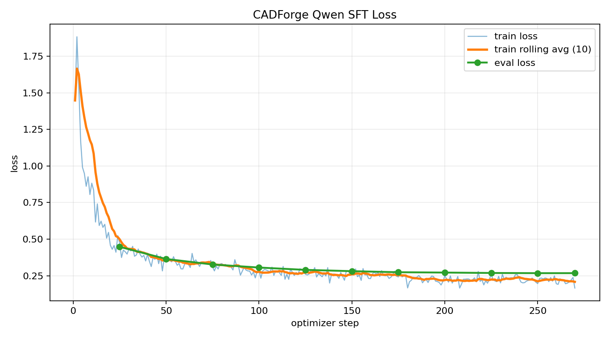

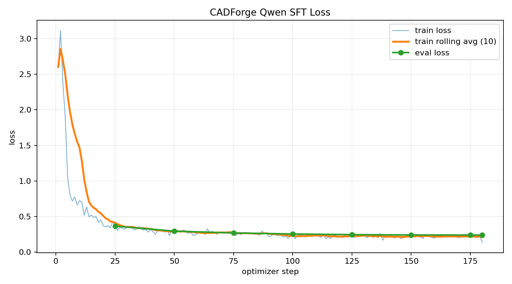

### Dense GRPO: Useful Signal, Bad Incentive

The first GRPO runs had positive-looking reward movement, but the debug rows exposed a problem: build rate was still `0%`. That means the reward was too generous. It was rewarding style and partial structure without forcing executable CAD.

| Run | Completions | Build rate | Mean / best reward | Lesson |
|---|---:|---:|---:|---|
| Qwen3.5-2B dense GRPO | 160 | `0.0%` | `0.3387 / 0.5303` | small model received signal, but reward was too forgiving |
| Qwen3.5-9B dense GRPO | 160 | `0.0%` | `0.4355 / 0.6828` | larger model got higher reward, but still failed buildability |

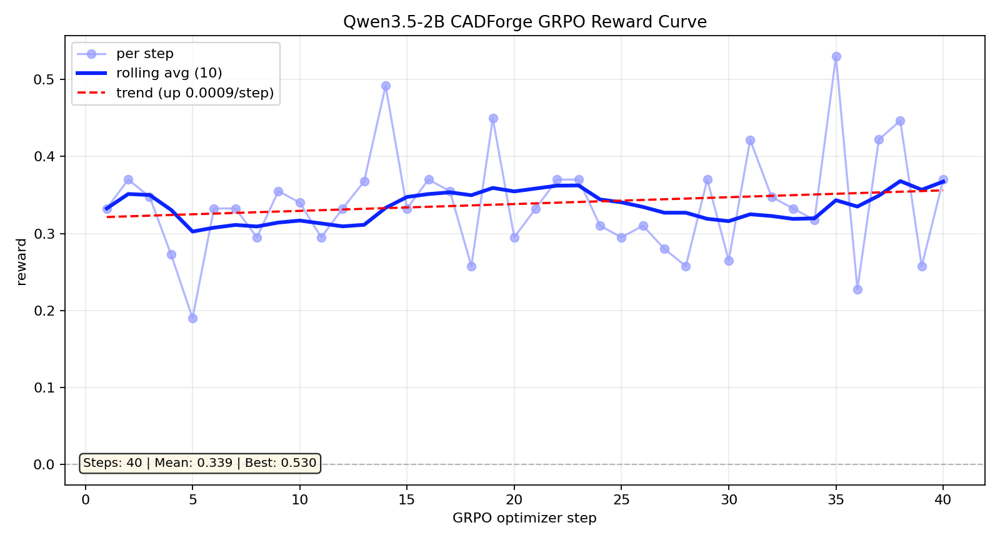

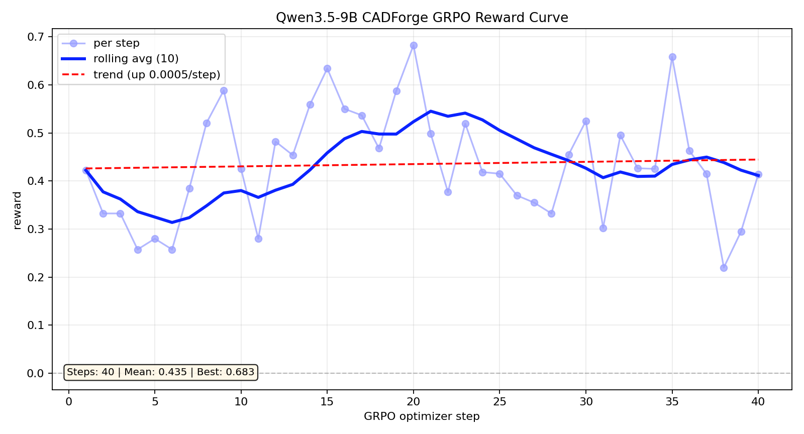

This was the most important environment-design lesson: in CAD, buildability must be the first gate.

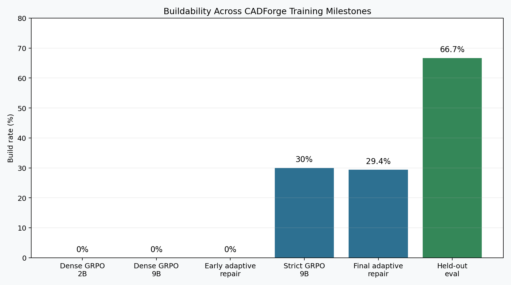

### Strict Build-Gated GRPO: The Breakthrough Run

The strict 9B GRPO run changed the reward. Broken builds became negative. Successful builds unlocked dense rewards.

| Metric | Value |
|---|---:|
| completions | 320 |
| buildable completions | 96 |
| build rate | 30.0% |
| best CADForge score | 0.9352 |
| best reward | 0.9449 |
| reward trend | +0.003549 / step |
| held-out eval build rate | 2 / 3 |

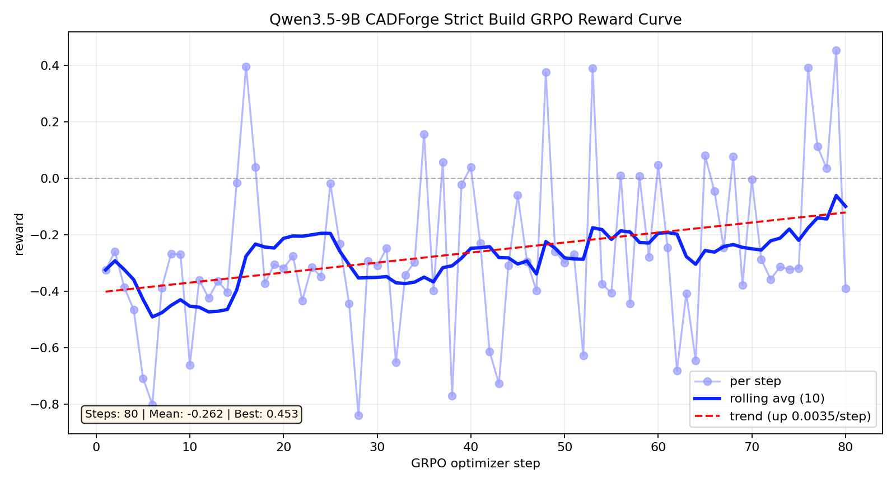

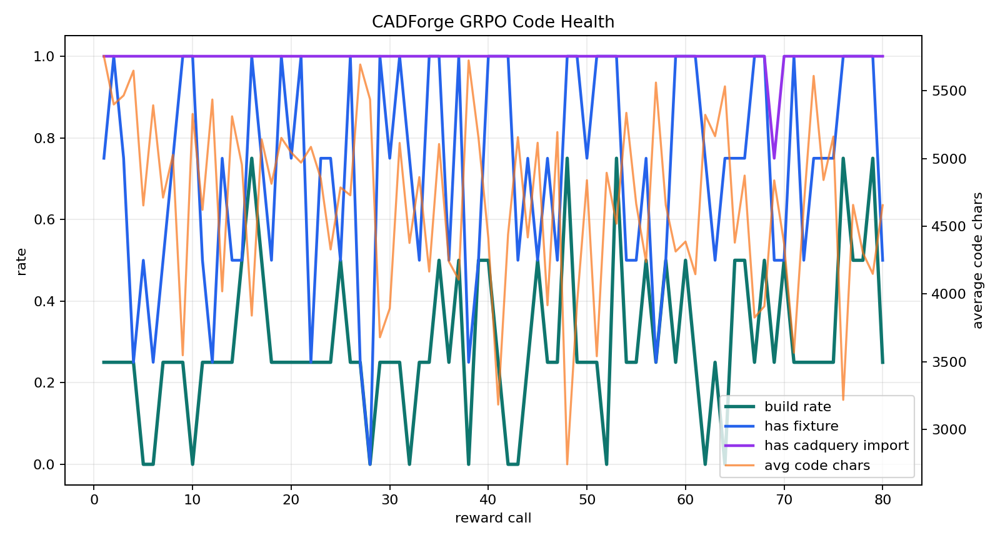

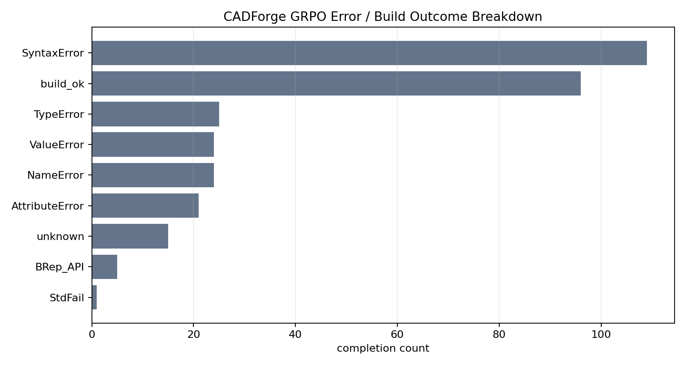

The held-out eval after strict GRPO built two of three prompts:

| Task | Reward | Build | Semantic | Editability |
|---|---:|---:|---:|---:|
| axial motor stator | 0.708 | 1.0 | 0.300 | 0.825 |
| caster wheel fork | 0.738 | 1.0 | 0.452 | 0.942 |
| four-leg chair | -1.000 | 0.0 | 0.000 | 0.000 |

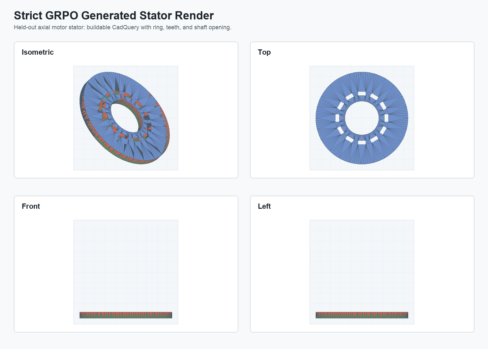

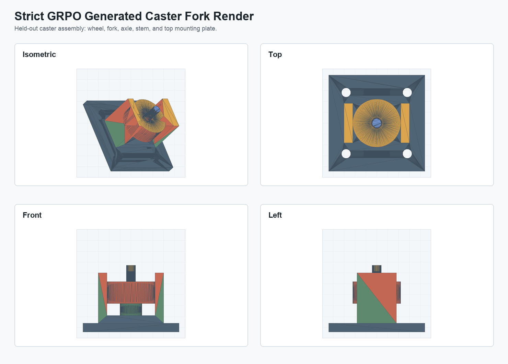

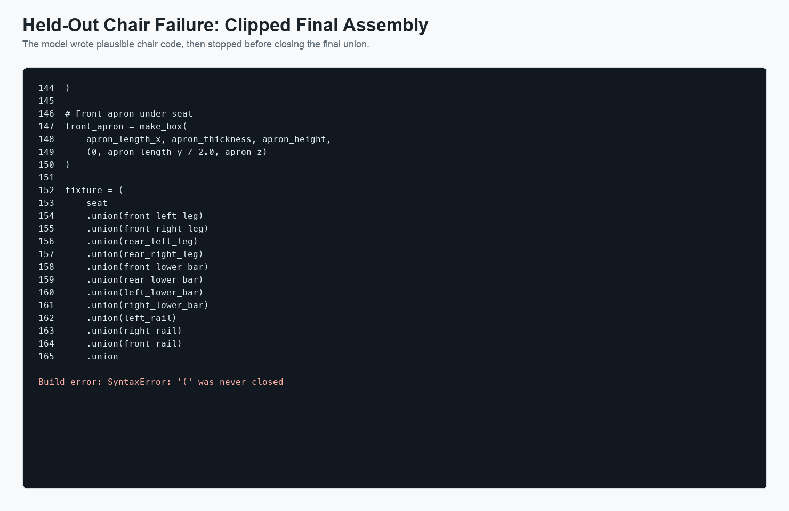

The chair still failed because the generated code clipped before closing the final assembly. That failure directly motivated the adaptive repair curriculum.

The same held-out prompt before and after strict GRPO makes the improvement more obvious:

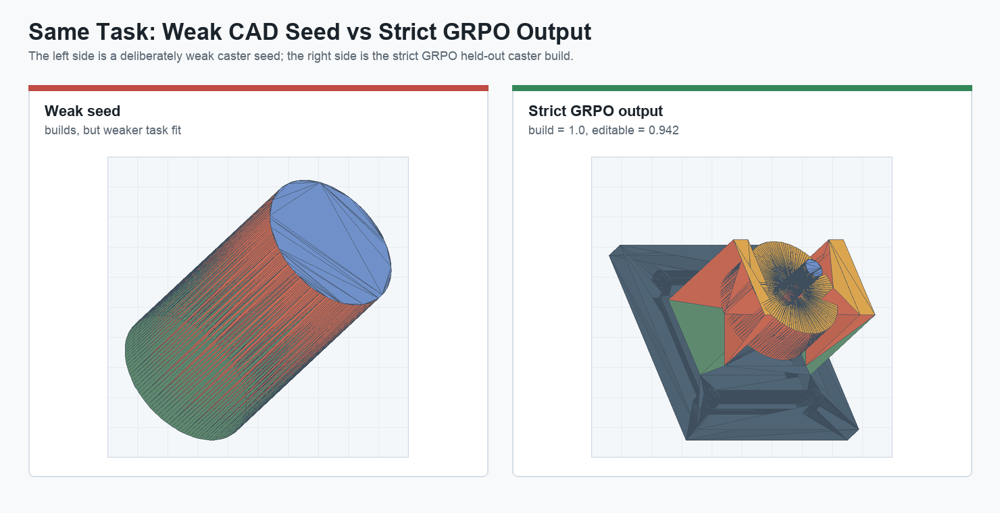

The important output is still editable code, not just a mesh:

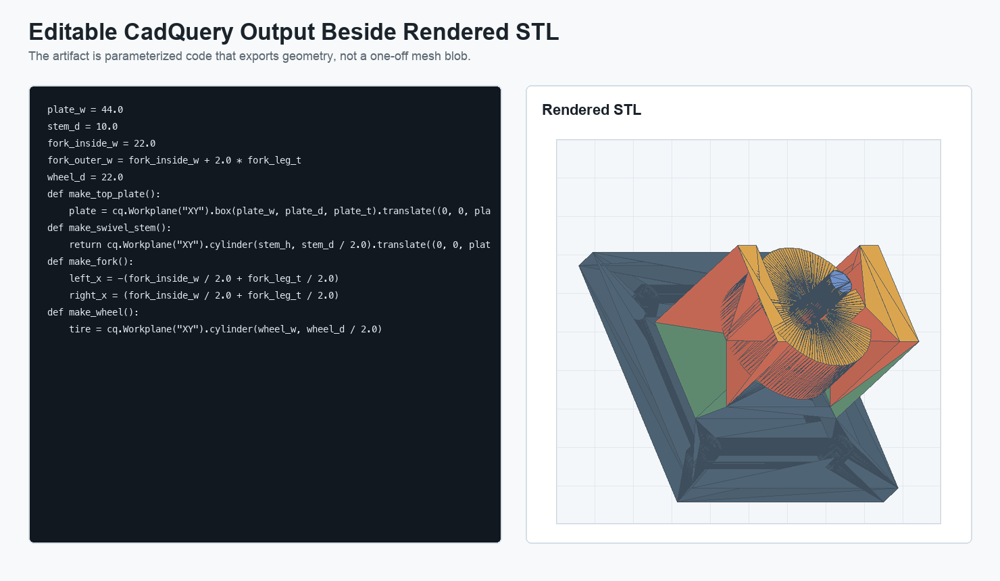

The local demo UI shows the intended interaction loop: prompt, code, render, reward, and repair feedback in one place.

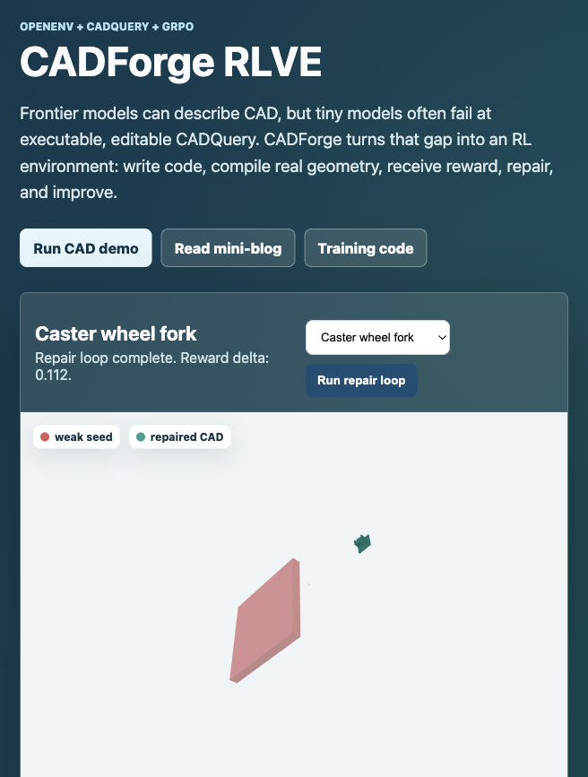

## Final Adaptive Repair Run

The final run, `20260426-adaptive-repair-final-8192`, is not another broad prompt-to-CAD run. It is a repair-specialization round.

| Choice | Strict GRPO run | Current adaptive repair run |
|---|---|---|
| Starting point | SFT adapter | strict-build GRPO adapter |
| Data | prompt-to-CAD training rows | 180 repair rows mined from strict GRPO debug failures |
| Main target | make first completions build | fix known failure classes from the current model |
| Reward | strict build gate + fast CADForge reward | same strict gate, but on repair prompts |
| Prompt shape | normal design request | failed code excerpt + verifier observation + rewrite instruction |
| Sequence budget | shorter completions | larger context and `8192` completion budget |

The earlier adaptive repair attempt exposed another mistake: completion length was too small for long broken CAD files, and many outputs clipped before the final `fixture`. That run showed `0%` builds and a 100% clipped-completion pattern, which is exactly the kind of bad result a real environment should surface quickly.

The final script fixed that experiment design:

- it starts from `outputs/qwen35-9b-cadforge-grpo-strict-build-20260426-strict-build`, not from the weaker SFT model;
- it generates a foundation-stage repair curriculum from strict GRPO debug rows;
- it keeps only a compact previous-code excerpt instead of dumping a huge failed file into the prompt;
- it asks for a short complete rewrite rather than a continuation of clipped code;
- it raises `MAX_COMPLETION_LENGTH` to `8192` and `MAX_SEQ_LENGTH` to `16384`;
- it keeps the strict build gate, so failed repairs stay negative.

The result validated the loop:

| Run | Repair completions | Built | Build rate | Fixture rate | Import rate | Clipped completions | Best reward | Best CADForge total |
|---|---:|---:|---:|---:|---:|---:|---:|---:|
| earlier adaptive repair | 120 | 0 | 0.0% | 0.8% | 96.7% | 100% pattern | -0.740 | -1.000 |
| final adaptive repair 8192 | 180 | 53 | 29.4% | 97.2% | 100.0% | 0 | 0.882 | 0.861 |

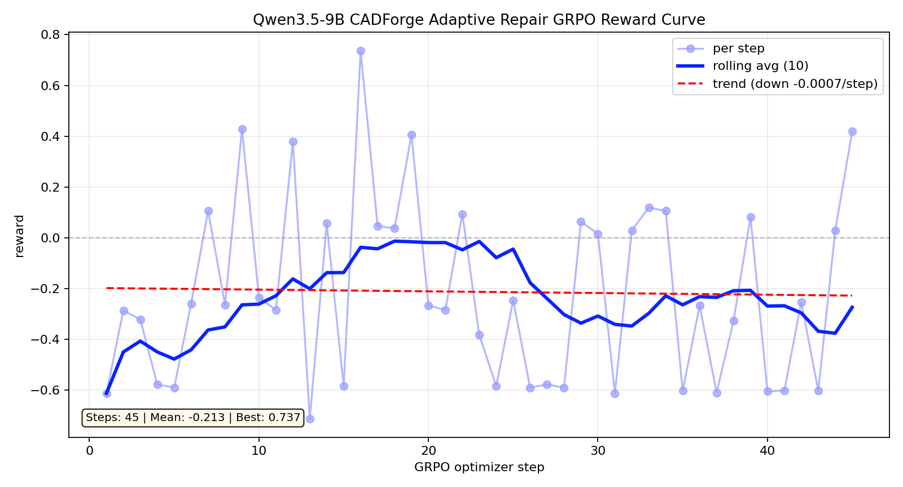

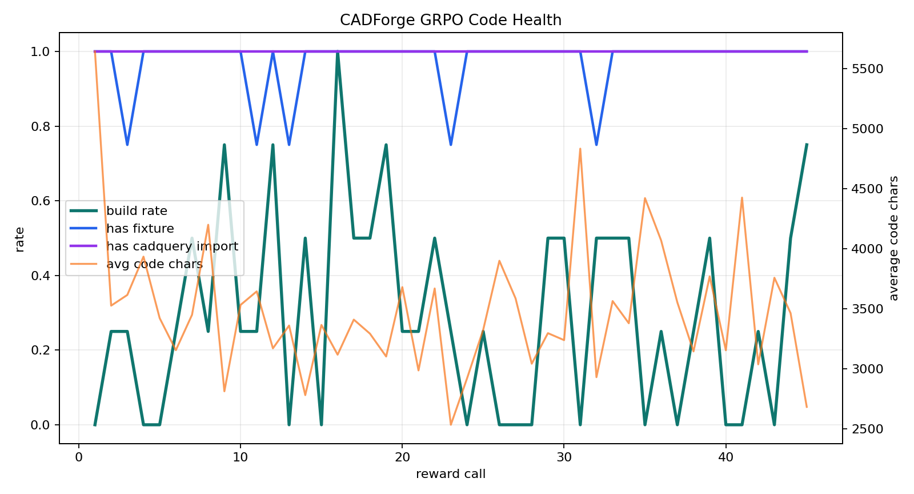

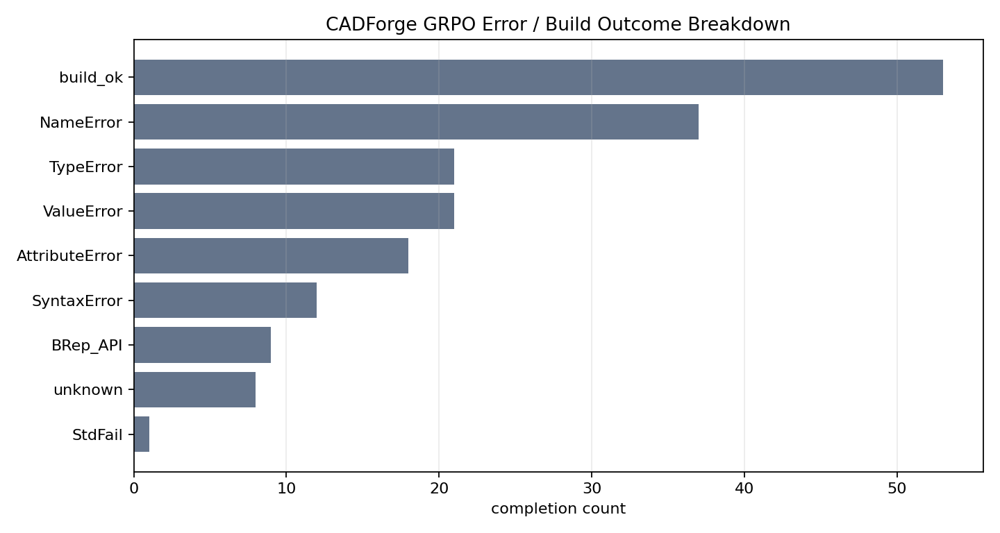

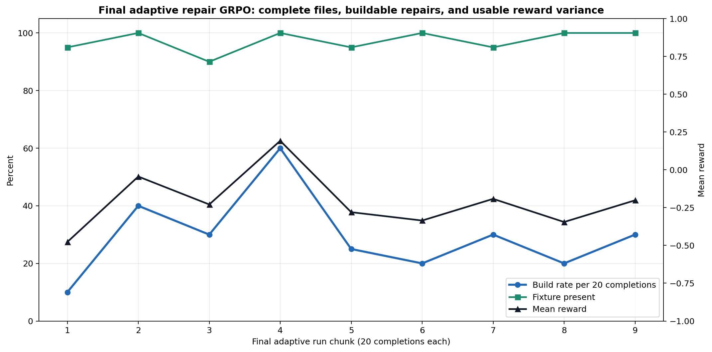

This is the cleanest self-improvement evidence in the project: CADForge found a failure class, generated the next repair curriculum, and the next run turned a clipped 0% repair run into 53 buildable repairs.

## Evidence From the Logs

The training evidence bundle contains both human-readable plots and raw JSONL traces. The important files are:

| Evidence file | What it proves |
|---|---|
| `training/logs/grpo-2b-completions.jsonl` | the 2B dense GRPO baseline received reward but built `0/160` completions |
| `training/logs/grpo-9b-completions.jsonl` | the 9B dense GRPO baseline also built `0/160`, proving dense reward was too forgiving |
| `training/logs/grpo-9b-strict-build-20260426-strict-build-completions.jsonl` | strict build gating produced `96/320` buildable completions |
| `training/logs/grpo-9b-20260426-adaptive-repair-completions.jsonl` | adaptive v1 failed with `0/120` builds, exposing clipped completions and poor curriculum ordering |
| `training/logs/grpo-9b-20260426-adaptive-repair-final-8192-completions.jsonl` | final adaptive repair produced `53/180` buildable repairs with `0` clipped completions |
| `training/reports/*/metrics.json` | parsed reward, loss, token, clipping, and optimizer metrics for custom charts |
| `training/reports/*/*.png` | judge-facing reward curves, code health plots, timelines, and error breakdowns |

This evidence matters because CADForge did not just train once and report a curve. It used the logs to change the environment:

1. Dense GRPO looked encouraging, but logs showed no builds.
2. Strict build gating turned failed CAD into negative reward.
3. Strict GRPO debug rows exposed the next failure distribution.
4. Adaptive repair v1 failed because completions were clipped.
5. The final 8192-token adaptive run fixed the setup and recovered buildable repairs.

That is the clearest Theme 4 claim: the environment adapts based on observed failures, and the logs show each adaptation.

## Final Inference Comparison

For a concrete final output, we compared base Qwen, RL-tuned Qwen, and a GPT-5.4 frontier artifact on the same medium-difficulty stator prompt.

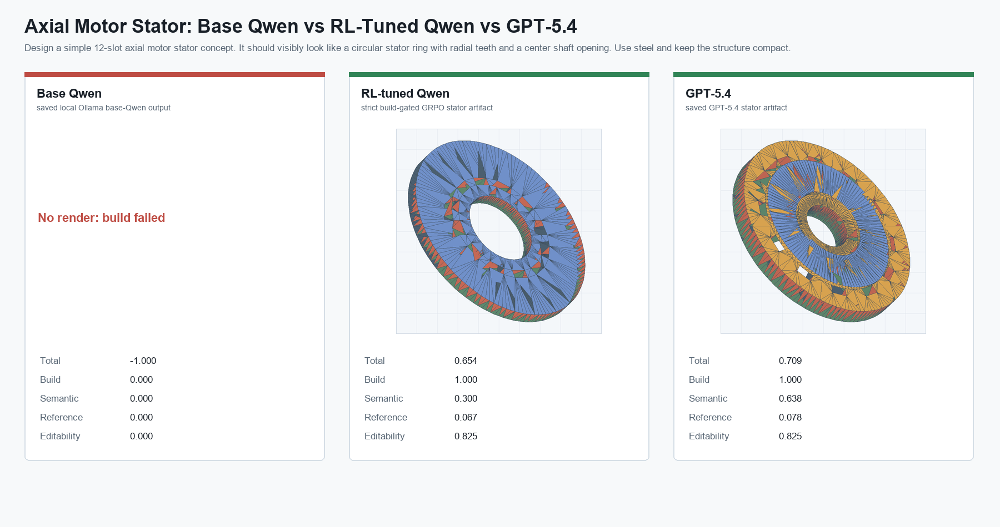

| Model | Total | Build | Semantic | Editability | What happened |
|---|---:|---:|---:|---:|---|
| Base Qwen | -1.000 | 0.0 | 0.000 | 0.000 | failed the export contract: no final `fixture` |
| RL-tuned Qwen | 0.654 | 1.0 | 0.300 | 0.825 | built a compact editable stator with ring, teeth, and center opening |
| GPT-5.4 | 0.709 | 1.0 | 0.638 | 0.825 | built a richer stator with stronger semantic detail |

This is not a claim that Qwen beats GPT-5.4. The frontier model is still stronger on semantic richness in this one example. The important result is that CADForge moved Qwen from a base-model build failure to a buildable, editable CAD output in the same part family where a frontier model succeeds.

That is the commercial shape of the project: use an RL environment to train small specialist CAD models until they compete with frontier models on narrower engineering workflows, then keep improving them through verifier feedback.

## What the Agent Learned

The strongest evidence is not that the final model is perfect. It is that training changed the failure distribution.

Before strict reward:

- models produced plausible code-shaped text,
- many outputs included imports and partial fixture structure,
- but build rate remained 0%.

After strict reward:

- 96 of 320 GRPO completions built successfully,
- held-out eval built 2 of 3 tasks,
- best CADForge score reached 0.9352,
- buildable outputs separated sharply from broken outputs.

After adaptive repair:

- 53 of 180 mined repair completions built successfully,
- fixture presence improved from 0.8% in the failed adaptive attempt to 97.2%,
- clipped completions dropped to 0,
- SyntaxError fell from 95/120 earlier adaptive rows to 12/180 final adaptive rows.

That is real learning signal. It also surfaces the next failure mode: after syntax closure improves, the remaining bottlenecks become undefined names, type/value CAD-kernel errors, and semantic assembly quality.

## Visual Asset Checklist

All must-have visuals are now present locally in `docs/detailed-blog/rendered-assets/` and referenced above:

| Visual | Status |
|---|---|
| strict GRPO generated stator render | present |
| strict GRPO generated caster fork render | present |
| failed chair or clipped-code screenshot | present |
| before/after base-or-weak vs strict GRPO comparison | present |
| successful reward JSON screenshot | present |
| failed build traceback/failure screenshot | present |
| demo UI screenshot | present |
| CadQuery snippet beside rendered STL | present |
| GLB reference beside generated CadQuery render | present |
| compact build-rate chart | present |
| adaptive curriculum failure-class chart | present |
| rendered environment loop diagram | present |
| rendered adaptive repair loop diagram | present |
| rendered prompt-image-GLB loop diagram | present |
| self-improvement loop summary | present |

The only additional images that would make the case stronger are:

- a side-by-side repair example: failed code/render on the left, repaired buildable CAD on the right;
- one real merged LoRA or demo inference screenshot if the model is served through vLLM or the Hugging Face Space;
- a STEP export screenshot once STEP output is added, because that speaks directly to CAD usefulness beyond STL.

## Future Work

The next version should:

- merge LoRA checkpoints and serve rollouts through vLLM for faster GRPO;
- cache GLB reference metrics so similarity rewards are cheap during training;
- use the final adaptive repair result to build the next curriculum around undefined names, type/value errors, and semantic assembly quality;
- add a mechanical-load reward once buildability is stable;
- generate thousands of prompt/image/GLB tasks through the reference loop;
- add STEP export and stricter CAD topology checks;
- track mastery per failure class over many short adaptive rounds.

## References

- RLCAD: Reinforcement Learning Training Gym for Revolution Involved CAD Command Sequence Generation, arXiv 2503.18549: https://arxiv.org/abs/2503.18549
- From Intent to Execution: Multimodal Chain-of-Thought Reinforcement Learning for Precise CAD Code Generation, arXiv 2508.10118: https://arxiv.org/abs/2508.10118
- CSGNet: Neural Shape Parser for Constructive Solid Geometry, CVPR 2018: https://openaccess.thecvf.com/content_cvpr_2018/html/Sharma_CSGNet_Neural_Shape_CVPR_2018_paper.html
- SAM 3D / image-to-3D reconstruction background: https://ai.meta.com/blog/sam-3d/
