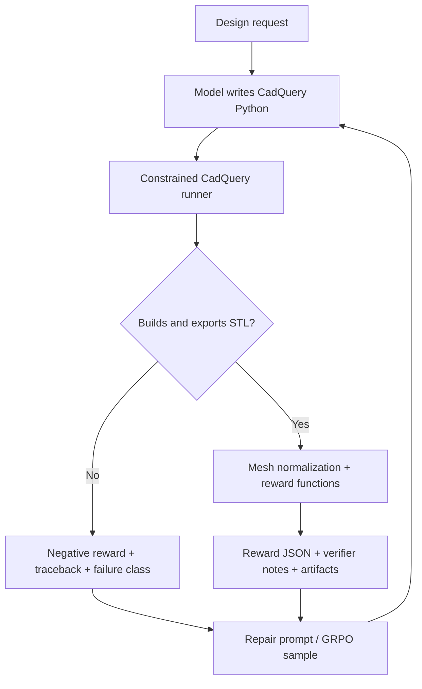
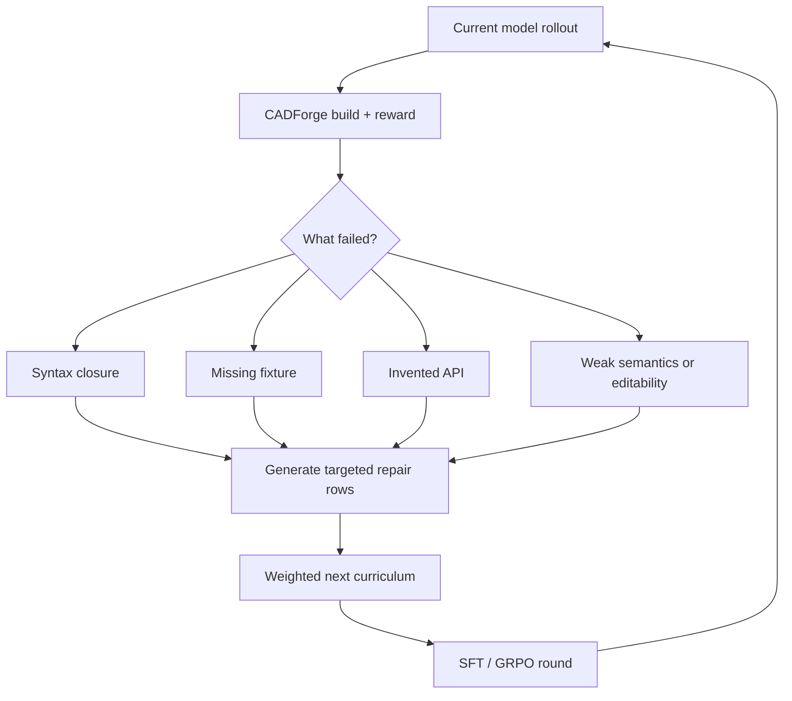
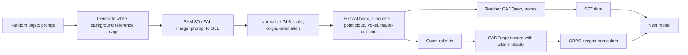

# CADForge: Teaching Small Models to Generate Buildable, Editable CAD

> Frontier models can talk about engineering geometry. CADForge asks a harder question: can a model write CAD code that compiles, exports, edits, and improves when a real verifier pushes back?

CADForge is an OpenEnv reinforcement-learning environment for code-CAD. The agent receives a design request, writes a complete CadQuery Python file, runs it through a real CadQuery/STL/reward backend, sees structured feedback, and learns to repair the model over repeated attempts.

The important distinction is this:

| Mesh generation | Code-CAD generation |
|---|---|
| produces a visual asset | produces editable engineering code |
| may look plausible | must compile and export geometry |
| often loses dimensions and design intent | keeps named dimensions, helper functions, and final assemblies |
| hard to repair through code | repairable by editing the feature tree |

CADForge is not trying to replace professional CAD in one shot. It is trying to create the missing training environment that lets models practice the real loop: write CAD, compile, inspect reward, repair, and repeat.

## The Problem: Frontier Models Still Fail at Complex CAD

We tested frontier models on a deceptively simple object: an IKEA Markus-style chair. The prompt is not a pure art prompt. It asks for a coherent code-CAD assembly with a seat, backrest, armrests, gas cylinder, star base, wheels, proportions, and final assembly.

The screenshots below show why CAD needs an environment, not just a better one-shot prompt.

### Claude Opus 4.7


Claude produced structured code and a recognizable intent, but the rendered assembly was not physically coherent. Large components floated, proportions drifted, and the final model did not behave like a connected CAD assembly.

### GPT-5.5


GPT-style frontier models can often produce verbose code, but complex CAD exposes brittle failure modes: clipped assemblies, weak connectivity, missing final fixtures, invented or fragile primitives, and proportions that do not match the reference.

### DeepSeek V4 Pro


DeepSeek showed the same pattern: plausible object vocabulary but weak executable geometry. This is exactly the gap CADForge targets. The problem is not only intelligence; it is training signal.

### Gemini 3.1 Pro


Gemini was comparatively stronger in these experiments. That matters because it hints that the task is learnable. The missing ingredient is not magic. It is repeated interaction with a verifier that rewards buildable, editable CAD.

## Why One-Shot CAD Fails

Complex CAD has several failure modes that plain text rewards do not catch:

| Failure | What it looks like | Why normal LLM training misses it |
|---|---|---|
| Syntax closure | code stops before closing the final union | text may look plausible until executed |
| Invented API | `Workplane.annulus()` or unsupported helpers | the model learns API-shaped language, not exact CAD APIs |
| Missing final fixture | no exportable final object | the answer reads like code but the environment has nothing to export |
| Floating parts | wheels, brackets, or backrests do not touch | language plausibility does not enforce contact geometry |
| Bad topology | non-manifold or brittle boolean output | only a CAD kernel can expose it |
| Weak semantics | generic blocks instead of requested parts | visual similarity and task hints need explicit reward |
| Low editability | opaque mesh-like code with no named dimensions | useful CAD needs parameters and reusable subassemblies |

This is why CADForge uses execution, mesh metrics, and reward JSON. It turns each failure into a training signal.

## The Initial Scope Was Even Bigger

The original ambition included CAD generation plus load analysis: generate a bracket, hook, fixture, or chair; run structural analysis; estimate safety factor; and reward mechanical strength under load.

That is still the long-term direction, but the hackathon scope was too large for a stable end-to-end FEA loop. We narrowed the MVP to the hardest prerequisite:

1. generate executable CadQuery,
2. export usable geometry,
3. score connectedness and semantics,
4. reward editability,
5. repair based on verifier feedback.

That narrowing was important. If the CAD does not compile, load analysis cannot even begin.

## What Makes CADForge Different

CADForge sits between three worlds: CAD program synthesis, image-to-3D reconstruction, and RL environments for tool-using agents.

| Category | What existing work usually optimizes | Limitation | CADForge difference |
|---|---|---|---|
| RLCAD-style CAD gyms | reconstruct CAD command sequences from existing B-Rep geometry | mostly reverse-engineering from target geometry, not open-ended object design | starts from a task prompt or reference object and rewards buildability, semantics, contact, and editability |
| CAD-RL / ExeCAD-style training | executable CADQuery from text or multimodal input | highly relevant, but more dataset/model-training oriented | exposes an interactive OpenEnv loop: generate, compile, validate, reward, repair |
| CSG program synthesis | recover constructive solid geometry programs | often synthetic/simple shapes, less engineering workflow | rewards code-CAD structure, named parameters, final assemblies, and physical connectedness |
| Image-to-3D / SAM 3D pipelines | visual 3D mesh reconstruction | GLBs are usually not editable CAD | uses image-to-GLB as a reference signal, then trains code-CAD to approximate it while staying editable |
| Frontier model direct CAD | one-shot code generation | brittle syntax, geometry, and assembly failures | converts every failure into reward and curriculum data |
| Generic text/image-to-3D | visual plausibility | not parametric, not dimensioned, not mechanically validated | targets real CadQuery code with STL/STEP pathway |

Related work shows the field is moving fast. RLCAD frames CAD generation as an RL gym over command sequences from B-Rep geometry, while CAD-RL/ExeCAD explores RL post-training for CADQuery executability and geometric accuracy. CSGNet showed the older shape-to-program direction for constructive solid geometry. SAM 3D-style systems make image-to-3D reconstruction much easier, but those outputs are still mesh references, not editable CAD. CADForge uses those ideas as ingredients for an OpenEnv training loop.

## The Environment Loop



Every episode can write:

- generated CadQuery code,
- build logs and tracebacks,
- STL exports,
- rendered views,
- reward JSON,
- verifier notes,
- markdown reports,
- training rows for SFT or GRPO.

This is why the project fits OpenEnv: the model is not answering a static question. It is interacting with a real toolchain and a persistent stateful environment.

## Reward Design

CADForge rewards are layered because CAD has multiple ways to fail.

| Reward dimension | What it checks | Why it matters |
|---|---|---|
| Build | Python + CadQuery executes and exports geometry | broken code is not CAD |
| Topology | non-empty volume, sane bounds, component count, watertight/manifold proxies | prevents empty or broken outputs |
| Contact | disconnected parts and excessive gaps | physical assemblies need contact or intentional joints |
| Semantic parts | task-specific hints in code and geometry | a stator should have ring/teeth/shaft opening; a caster should have wheel/fork/axle |
| Reference similarity | bbox, silhouettes, point/voxel/mesh metrics when a GLB exists | aligns code-CAD to reference objects |
| Editability | named dimensions, helper functions, final `fixture`, clean reusable structure | rewards useful CAD, not opaque mesh blobs |
| Efficiency | compact, stable code | discourages bloated or fragile programs |

The key lesson from training was reward order. Dense reward was useful, but too forgiving. The model could receive partial reward while still failing the build gate. The strict reward changed the order:

1. if CadQuery does not build, return a negative reward with diagnostics;
2. if it builds, unlock the dense CADForge rewards;
3. mine the failure class for the next curriculum.

## Training Data: What the Model Actually Saw

The dataset combined two different skills.

### Cold-Start Prompt to CAD

These rows teach the model how to produce a complete first answer.

```text
User:
Design a small caster wheel assembly as editable code-CAD.
Include a wheel, axle, U-shaped fork, swivel stem, and top mounting plate with four holes.

Assistant:
import cadquery as cq

wheel_r = 16
wheel_w = 8
...
fixture = plate.union(fork).union(wheel).clean()
```

### Repair From Environment Feedback

These rows teach the model how to respond when CADForge finds a concrete failure.

```text
User:
Task:
Build a 12-slot axial motor stator.

Previous candidate failed CADForge verification.

Observation:
{
  "failure_type": "invented_api",
  "previous_reward": {"total": -1.0, "build": 0.0},
  "error_tail": "AttributeError: Workplane object has no attribute annulus"
}

Previous CadQuery code:
<failed code>

Repair it into a complete executable CadQuery Python file.
Return only the repaired Python file.

Assistant:
<corrected complete CadQuery file>
```

The SFT mix intentionally upsamples cold-start rows, meaning those rows are repeated more often. That does **not** mean they are excluded. It means the opposite: because repair traces outnumber first-attempt examples, the training mix repeats prompt-to-CAD rows so the model learns both starting and repairing.

## Two Self-Improvement Loops

CADForge has two loops. One improves the model from its own failures. The other scales task diversity from prompts, images, and GLBs.

### Loop 1: Adaptive Repair Curriculum



This is the environment "fighting back." If the model keeps clipping code before `fixture`, the next batch includes more syntax-closure repairs. If it invents APIs, the next batch asks it to rewrite using conservative primitives. If it builds but misses semantics, the next batch asks for named subassemblies and recognizable features.

The adaptive curriculum generator produced a 180-row repair set from 320 strict GRPO rollouts. It found:

| Failure class | Count |
|---|---:|
| syntax closure | 110 |
| type/value/CAD kernel errors | 47 |
| disconnected or weak geometry | 26 |
| undefined names | 20 |
| invented API | 17 |
| missing fixture | 15 |
| unknown build failure | 15 |
| low editability | 4 |

This is the next curriculum target. It should be run as staged curriculum: first short buildable repairs with generous completion length, then harder semantic and reference-similarity repairs after the model is reliably closing files.

This is still valuable. It proves the environment can discover a new weakness automatically and produce the next training distribution.

### Loop 2: Prompt to Image to GLB to CAD Reward



This is the scalable route. A human does not need to hand-design every CAD target. The pipeline can generate many task prompts, create reference images, turn them into GLBs, extract similarity signals, and train models to write editable CadQuery that approximates the object.

The wedge is important:

> Image-to-3D gives us a reference mesh. CADForge turns that reference into a reward signal for editable code-CAD.

With 3,000 to 5,000 diverse objects, this becomes a plausible route to a small CAD-specialist model that can start from a prompt, generate buildable CadQuery, and repair itself under verifier feedback.

## Training Runs

The judge-facing model artifacts are on Hugging Face:

| Artifact | What it means | Link |
|---|---|---|
| Qwen3.5-2B SFT | small model learns CADQuery grammar and repair format | [model](https://huggingface.co/sanjuhs/qwen35-2b-cadforge-sft-lora) |
| Qwen3.5-2B SFT + GRPO | first dense reward probe | [model](https://huggingface.co/sanjuhs/qwen35-2b-cadforge-grpo-lora) |
| Qwen3.5-9B SFT | larger model learns syntax/style faster | [model](https://huggingface.co/sanjuhs/qwen35-9b-cadforge-sft-lora) |
| Qwen3.5-9B SFT + dense GRPO | dense reward before strict build gating | [model](https://huggingface.co/sanjuhs/qwen35-9b-cadforge-grpo-lora) |
| Qwen3.5-9B strict GRPO | best current result; build-gated reward | [model](https://huggingface.co/sanjuhs/qwen35-9b-cadforge-grpo-strict-build-lora) |

### SFT Results

SFT clearly worked. It taught the base models the language and structure of CadQuery outputs.

| Run | Train loss | Eval loss | Interpretation |
|---|---:|---:|---|
| Qwen3.5-2B SFT | `1.4480 -> 0.1658` | `0.4477 -> 0.2676` | learned basic grammar and repair format |
| Qwen3.5-9B SFT | `2.6020 -> 0.1413` | `0.3650 -> 0.2398` | stronger syntax/style learning |


### Dense GRPO: Useful Signal, Bad Incentive

The first GRPO runs had positive-looking reward movement, but the debug rows exposed a problem: build rate was still `0%`. That means the reward was too generous. It was rewarding style and partial structure without forcing executable CAD.

| Run | Completions | Build rate | Mean / best reward | Lesson |
|---|---:|---:|---:|---|
| Qwen3.5-2B dense GRPO | 160 | `0.0%` | `0.3387 / 0.5303` | small model received signal, but reward was too forgiving |
| Qwen3.5-9B dense GRPO | 160 | `0.0%` | `0.4355 / 0.6828` | larger model got higher reward, but still failed buildability |


This was the most important environment-design lesson: in CAD, buildability must be the first gate.

### Strict Build-Gated GRPO: The Breakthrough Run

The strict 9B GRPO run changed the reward. Broken builds became negative. Successful builds unlocked dense rewards.

| Metric | Value |
|---|---:|
| completions | 320 |
| buildable completions | 96 |
| build rate | 30.0% |
| best CADForge score | 0.9352 |
| best reward | 0.9449 |
| reward trend | +0.003549 / step |
| held-out eval build rate | 2 / 3 |


The held-out eval after strict GRPO built two of three prompts:

| Task | Reward | Build | Semantic | Editability |
|---|---:|---:|---:|---:|
| axial motor stator | 0.708 | 1.0 | 0.300 | 0.825 |
| caster wheel fork | 0.738 | 1.0 | 0.452 | 0.942 |
| four-leg chair | -1.000 | 0.0 | 0.000 | 0.000 |

The chair still failed because the generated code clipped before closing the final assembly. That failure directly motivated the adaptive repair curriculum.

## What the Agent Learned

The strongest evidence is not that the final model is perfect. It is that training changed the failure distribution.

Before strict reward:

- models produced plausible code-shaped text,
- many outputs included imports and partial fixture structure,
- but build rate remained 0%.

After strict reward:

- 96 of 320 GRPO completions built successfully,
- held-out eval built 2 of 3 tasks,
- best CADForge score reached 0.9352,
- buildable outputs separated sharply from broken outputs.

That is real learning signal. It also surfaces the next failure mode: long complex objects like chairs still need better syntax-closure and final assembly discipline.

## The Demo Story for Judges

The story should be shown in four beats:

1. **Frontier models struggle.** Show the Markus chair screenshots. Even huge models produce floating, disconnected, or brittle CAD.
2. **CADForge turns failure into reward.** Show the environment loop and reward table.
3. **SFT teaches syntax; GRPO teaches buildability.** Show SFT loss curves and strict GRPO reward/code-health graphs.
4. **The environment self-improves.** Show the adaptive curriculum loop: failed rollouts become the next training rows.

For non-technical audiences, the line is:

> We built a CAD teacher. It compiles the student's design, tells it exactly how it failed, and creates the next lesson from that failure.

For technical audiences, the line is:

> CADForge is a build-gated RLVE for executable CadQuery, with reward dimensions for topology, contact, semantic parts, reference similarity, editability, and adaptive curriculum mining from real compiler/geometry failures.

## What Screenshots We Still Want

The blog is ready to accept more visuals. The best additions would be:

| Screenshot | Why it helps |
|---|---|
| baseline tiny Qwen output that does not compile | shows cold-start failure |
| SFT output that compiles but is semantically weak | shows SFT learns syntax first |
| strict GRPO output that builds stator/caster | shows RL reward improves behavior |
| Hugging Face Space before/after repair loop | makes the demo tangible |
| GLB reference next to generated CadQuery render | explains reference similarity |
| one slide-style summary of both self-improvement loops | helps non-technical judges |

## Why This Fits the Judging Criteria

### Environment Innovation: 40%

CADForge is novel because it is not just another text-to-3D generator. It is a real tool-using CAD environment:

- executable CadQuery code as the action,
- real compiler/export feedback,
- persistent artifacts,
- semantic and editability reward,
- GLB reference similarity,
- adaptive failure mining.

The challenge is genuinely hard because the model must satisfy syntax, API correctness, geometry, task semantics, and code structure at the same time.

### Storytelling and Presentation: 30%

The story is easy to follow:

1. even frontier models struggle with complex CAD;
2. a verifier catches what humans see immediately: floating parts, bad proportions, broken code;
3. SFT teaches the model to speak CadQuery;
4. GRPO teaches it that buildable CAD is better than broken text;
5. the environment mines failures to create the next curriculum.

### Showing Improvement in Rewards: 20%

The reward evidence is concrete:

- SFT loss falls for both 2B and 9B;
- dense GRPO exposed reward design flaws;
- strict GRPO produced 30% buildable completions and best score 0.9352;
- held-out eval built 2 of 3 objects;
- adaptive curriculum mining identified the next bottleneck: syntax closure on long repairs.

### Reward and Training Pipeline: 10%

The pipeline is coherent:

- prompt-to-CAD and repair SFT rows teach format;
- strict build-gated GRPO executes every candidate;
- reward JSON separates build, topology, semantics, reference similarity, and editability;
- failed trajectories are converted into targeted repair tasks;
- GLB reference generation gives a scalable route to more tasks.

## Future Work

The next version should:

- merge LoRA checkpoints and serve rollouts through vLLM for faster GRPO;
- cache GLB reference metrics so similarity rewards are cheap during training;
- shorten adaptive repair prompts to reduce syntax clipping;
- add a mechanical-load reward once buildability is stable;
- generate thousands of prompt/image/GLB tasks through the reference loop;
- add STEP export and stricter CAD topology checks;
- track mastery per failure class over many short adaptive rounds.

## References

- RLCAD: Reinforcement Learning Training Gym for Revolution Involved CAD Command Sequence Generation, arXiv 2503.18549: https://arxiv.org/abs/2503.18549
- From Intent to Execution: Multimodal Chain-of-Thought Reinforcement Learning for Precise CAD Code Generation, arXiv 2508.10118: https://arxiv.org/abs/2508.10118
- CSGNet: Neural Shape Parser for Constructive Solid Geometry, CVPR 2018: https://openaccess.thecvf.com/content_cvpr_2018/html/Sharma_CSGNet_Neural_Shape_CVPR_2018_paper.html
- SAM 3D / image-to-3D reconstruction background: https://ai.meta.com/blog/sam-3d/
