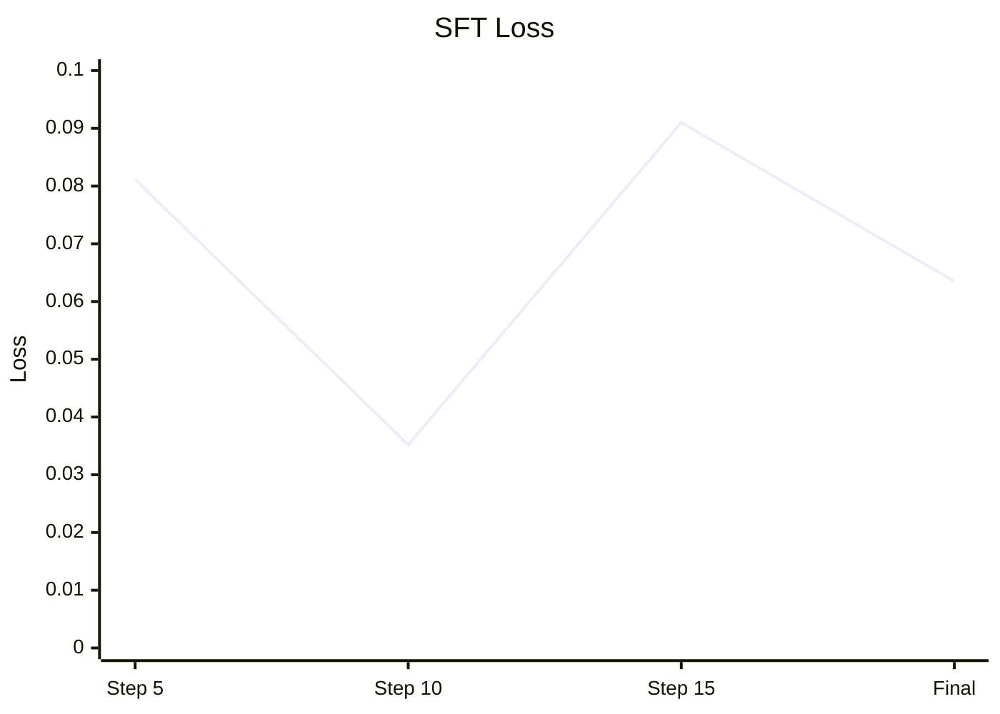
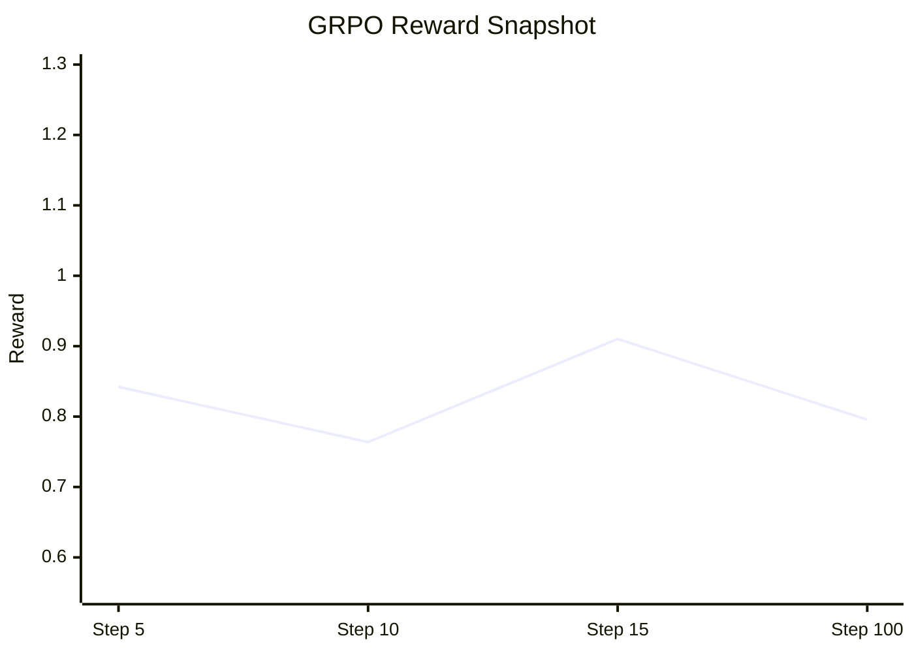
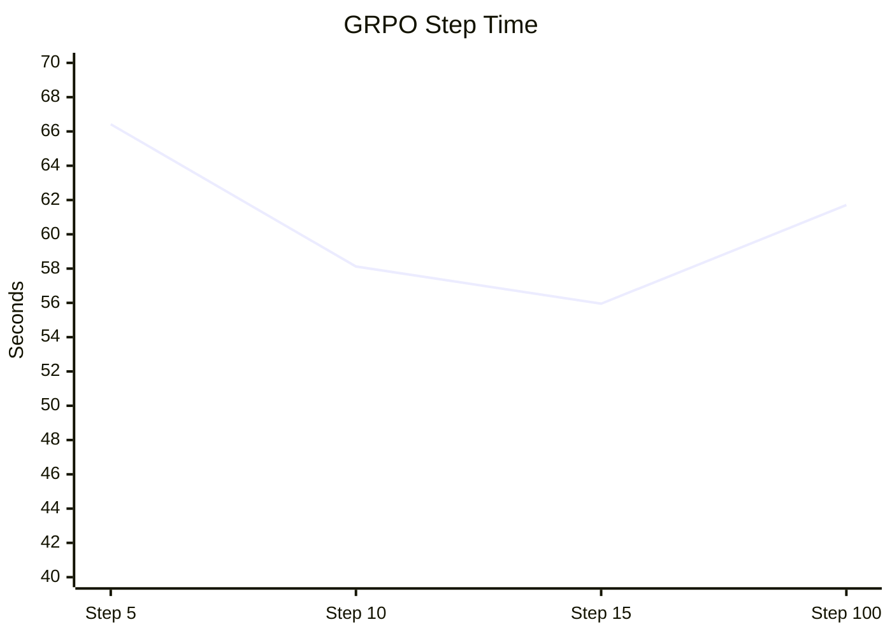
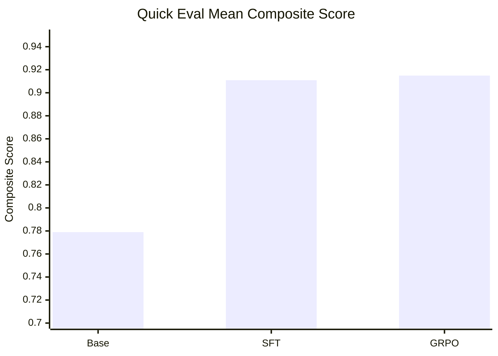
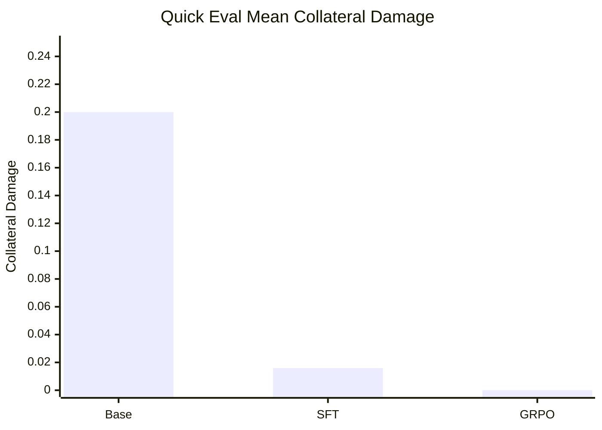

# DocEdit Qwen2.5-3B SFT + GRPO Post-Mortem

Date:
- April 17, 2026

Hardware:
- `1x H200 SXM`

Base model:
- `Qwen/Qwen2.5-3B-Instruct`

Training recipe:
- `LoRA SFT`
- `LoRA GRPO`

Primary Hub repo:
- [sanjuhs/docedit-qwen25-3b-checkpoints](https://huggingface.co/sanjuhs/docedit-qwen25-3b-checkpoints)

---

## 1. Goal

The goal of this run was to answer a narrow but important question:

> Can a small open model be adapted and reinforcement-tuned to repair corrupted structured documents?

This was not yet the final tool-policy architecture.

Instead, this run intentionally produced a **rewrite-policy baseline** that we can later compare against:
- frontier-model tool use
- tool-trajectory training
- planner -> applicator architectures

---

## 2. What We Ran

### SFT stage

We trained a LoRA adapter on paired:
- corrupted document
- repaired target document

This teaches:
- markup discipline
- structured output behavior
- basic repair mapping

### GRPO stage

We then continued from the SFT adapter using verifier-based RL.

Reward ingredients:
- structural correctness
- edit accuracy
- collateral damage penalty
- output format penalty

---

## 3. Final Training Outcome

### SFT

- runtime: about `109.38s`
- final train loss: about `0.06346`
- final mean token accuracy: about `0.98954`

### GRPO

- runtime: about `5562.75s`
- total steps: `100`
- final train loss: about `0.03506`
- final logged step-100 reward mean: about `0.79567`

GRPO checkpoints written:
- `checkpoint-25`
- `checkpoint-50`
- `checkpoint-75`
- `checkpoint-100`

---

## 4. SFT Loss Curve

## 5. GRPO Reward Curve Snapshot

## 6. GRPO Step Time Snapshot

---

## 7. Quick Directional Eval

After training, we ran a **very small** local eval on `3` validation cases for:
- base model
- SFT adapter
- final GRPO adapter

This is not a full benchmark.

It is only a quick directional comparison to tell us whether the trained adapters are plausibly improving over baseline.

### 3-case quick eval results

| Model | Cases | Exact match rate | Mean similarity | Mean composite score | Mean edit accuracy | Mean collateral damage |
|---|---:|---:|---:|---:|---:|---:|
| Base `Qwen2.5-3B-Instruct` | 3 | 0.0000 | 0.9358 | 0.7790 | 0.4444 | 0.2000 |
| `Qwen2.5-3B + SFT LoRA` | 3 | 0.3333 | 0.9964 | 0.9109 | 0.6667 | 0.0159 |
| `Qwen2.5-3B + GRPO LoRA` | 3 | 0.3333 | 0.9964 | 0.9149 | 0.6667 | 0.0000 |

### Visual comparison

### What this means

On this very small check:
- SFT clearly improved over the base model
- GRPO slightly improved over SFT on composite score
- GRPO also reduced collateral damage to zero on this 3-case slice

This is encouraging, but it is **not enough** to claim robust superiority yet.

---

## 8. What Went Well

1. The H200 setup worked well for this scale.
2. SFT completed quickly and produced a clean LoRA adapter.
3. GRPO completed fully and wrote multiple checkpoints.
4. The final GRPO adapter loads and generates correctly.
5. The quick directional eval suggests the trained adapters beat the untuned base model.

---

## 9. What Did Not Go Perfectly

1. The current policy is still a **rewrite policy**, not the final tool-call architecture.
2. We had to patch `run_grpo.py` during the run to match the installed TRL version.
3. We also had to fix a repo-root import issue in the GRPO entrypoint.
4. The currently published eval is still small and should be treated as a sanity check, not a full research result.

---

## 10. Biggest Strategic Takeaway

This run successfully answers:

> Can we fine-tune and RL-tune a small model for DocEdit on one H200?

Answer:
- **yes**

But it does **not** yet settle the bigger architecture question:

> Is rewrite-policy the right final product design?

The answer there is still:
- **probably not**

The next likely better direction is:
- frontier model plans edits
- smaller executor/applicator handles structured edit application
- or frontier model directly uses a compact patch language

This run is therefore best understood as:
- a successful baseline
- a checkpoint artifact
- a comparison anchor for future tool-policy work

---

## 11. Recommended Next Steps

1. Run `GPT-5.4` directly with a compact edit language or tool schema.
2. Compare that against this rewrite-policy baseline.
3. Decide whether to:
   - keep frontier-only tool use
   - or distill those edit traces into a smaller applicator model
4. Move future training toward:
   - structured edit plans
   - tool trajectories
   - planner -> executor separation

---

## 12. Final Judgment

Was the H200 run worth doing?

- **Yes.**

Why?
- it produced complete SFT and GRPO artifacts
- it gave us a usable small-model baseline
- it generated a real comparison point for future design decisions

Would I immediately continue training more rewrite-policy models after this?

- **No.**

I would pause here, keep these artifacts, and move the next cycle toward the cleaner frontier-planner / structured-edit direction.
